# Activity Diagram - SPK-MOORA

Dokumen ini mendefinisikan dan memetakan **Activity Diagram** (Diagram Aktivitas) dengan format **3 Kolom (Swimlane)** untuk alur kerja sistem pendakian gunung dan sistem rekomendasi **SPK-MOORA**.

Dalam diagram ini, seluruh proses terjadi di dalam lingkup internal sistem aplikasi itu sendiri (tanpa melibatkan pihak ketiga eksternal seperti agen bus atau basecamp), terbagi menjadi 3 kolom tanggung jawab:
1. **Pendaki**: Aktor pengguna yang mencari rekomendasi, memilih rute ideal, dan mencetak rincian biaya.
2. **Sistem SPK-MOORA**: Sistem aplikasi web (Laravel) yang memproses validasi, penyaringan budget, perhitungan algoritme MOORA, visualisasi hasil, hingga pembuatan file cetak PDF.
3. **Admin**: Aktor pengelola yang menyiapkan data pendukung (data gunung, terminal, jalur, biaya bus) serta melakukan pembobotan kriteria dan penilaian alternatif.

---

## Activity Diagram Sistem SPK-MOORA (3 Kolom)

### Ilustrasi Visual

### Alur Diagram (Mermaid)
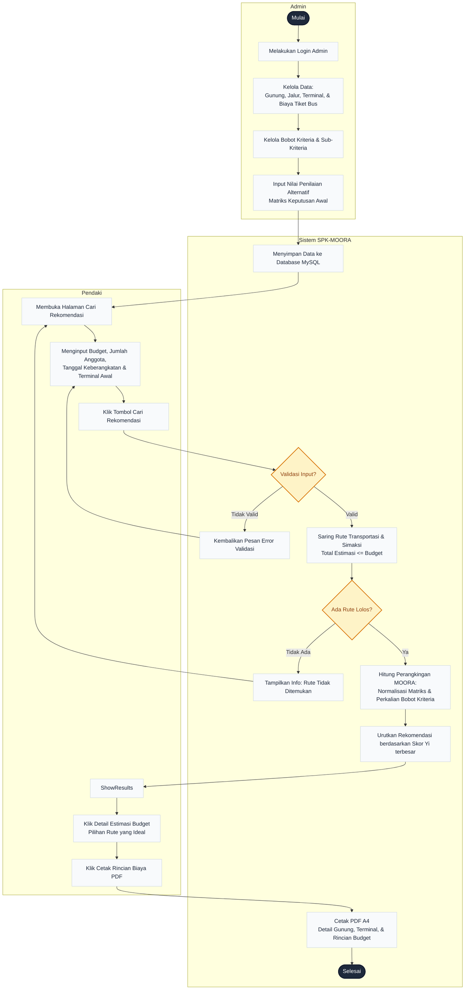
```mermaid
graph TD
    subgraph AktorPendaki [Pendaki]
        OpenWeb[Membuka Halaman Cari Rekomendasi] --> InputForm[Menginput Budget, Jumlah Anggota,<br>Tanggal Keberangkatan & Terminal Awal]
        InputForm --> ClickSearch[Klik Tombol Cari Rekomendasi]
        ShowResults --> SelectRoute[Klik Detail Estimasi Budget<br>Pilihan Rute yang Ideal]
        SelectRoute --> ClickPrint[Klik Cetak Rincian Biaya PDF]
    end

    subgraph SistemWeb [Sistem SPK-MOORA]
        ClickSearch --> Validate{Validasi Input?}
        Validate -- Tidak Valid --> ShowError[Kembalikan Pesan Error Validasi]
        Validate -- Valid --> FilterBudget[Saring Rute Transportasi & Simaksi<br>Total Estimasi <= Budget]
        
        FilterBudget --> CheckRoutes{Ada Rute Lolos?}
        CheckRoutes -- Tidak Ada --> ShowEmpty[Tampilkan Info: Rute Tidak Ditemukan]
        
        CheckRoutes -- Ya --> CalculateMOORA[Hitung Perangkingan MOORA:<br>Normalisasi Matriks & Perkalian Bobot Kriteria]
        
        CalculateMOORA --> SortResults[Urutkan Rekomendasi berdasarkan Skor Yi terbesar]
        SortResults --> ShowResults
        
        ClickPrint --> PrintWindow[Cetak PDF A4<br>Detail Gunung, Terminal, & Rincian Budget]
        PrintWindow --> EndSystem([Selesai])
        
        SaveDB[Menyimpan Data ke Database MySQL] --> OpenWeb
    end

    subgraph AktorAdmin [Admin]
        StartAdmin([Mulai]) --> LoginAdmin[Melakukan Login Admin]
        LoginAdmin --> ManageData[Kelola Data:<br>Gunung, Jalur, Terminal, & Biaya Tiket Bus]
        ManageData --> ManageCriteria[Kelola Bobot Kriteria & Sub-Kriteria]
        ManageCriteria --> InputRatings[Input Nilai Penilaian Alternatif<br>Matriks Keputusan Awal]
        InputRatings --> SaveDB
    end

    ShowError --> InputForm
    ShowEmpty --> OpenWeb

    %% Styles
    classDef startEnd fill:#1e293b,stroke:#0f172a,stroke-width:2px,color:#fff;
    classDef process fill:#f8fafc,stroke:#cbd5e1,stroke-width:1px,color:#1e293b;
    classDef decision fill:#fef3c7,stroke:#d97706,stroke-width:2px,color:#92400e;
    
    class StartAdmin,EndSystem startEnd;
    class OpenWeb,InputForm,ClickSearch,ShowError,FilterBudget,ShowEmpty,CalculateMOORA,SortResults,ShowResults,SelectRoute,ClickPrint,PrintWindow,LoginAdmin,ManageData,ManageCriteria,InputRatings,SaveDB process;
    class Validate,CheckRoutes decision;
```

---

## Penjelasan Alur Proses Kerja Sistem

Berikut adalah urutan langkah demi langkah berdasarkan diagram aktivitas di atas:

1. **Persiapan Data oleh Admin**:
   * **Admin** memulai alur kerja dengan masuk ke halaman admin (`Login Admin`).
   * Admin mengelola master data (`Kelola Data`), termasuk data Gunung, Jalur Pendakian, Terminal transit, dan tarif Biaya tiket bus.
   * Admin mengatur preferensi kriteria dan bobot kriteria (`Kelola Bobot Kriteria & Sub-Kriteria`).
   * Admin memasukkan skor penilaian untuk setiap alternatif jalur pendakian berdasarkan kriteria yang ditentukan (`Input Nilai Penilaian Alternatif`).
   * Nilai-nilai tersebut dikirim ke **Sistem SPK-MOORA** untuk disimpan secara permanen di database MySQL (`Menyimpan Data ke Database MySQL`).

2. **Proses Pencarian Rekomendasi oleh Pendaki**:
   * **Pendaki** membuka antarmuka rekomendasi (`Membuka Halaman Cari Rekomendasi`).
   * Pendaki memasukkan kriteria pencarian berupa nominal budget, total anggota kelompok, tanggal keberangkatan, dan terminal asal (`Menginput Budget, Jumlah Anggota, Tanggal & Terminal Awal`).
   * Pendaki mengklik tombol cari rekomendasi (`Klik Tombol Cari Rekomendasi`).

3. **Perhitungan & Filter oleh Sistem**:
   * **Sistem SPK-MOORA** melakukan pemeriksaan data (`Validasi Input?`). Jika tidak valid, pendaki diminta melengkapi kembali inputnya.
   * Sistem kemudian mencocokkan tanggal keberangkatan (weekday/weekend/event khusus) serta terminal asal untuk menyaring rute transportasi dan biaya simaksi (`Saring Rute Transportasi & Simaksi`). Jalur yang memiliki total estimasi biaya lebih besar dari budget pendaki akan langsung disaring keluar.
   * Sistem mengecek apakah ada rute yang lolos filter budget (`Ada Rute Lolos?`). Jika tidak ada, sistem mengembalikan informasi bahwa rute tidak ditemukan.
   * Jika ada rute yang lolos, sistem memproses data matriks alternatif yang lolos menggunakan metode MOORA (`Hitung Perangkingan MOORA`). Proses ini melibatkan normalisasi matriks keputusan awal dan perkalian dengan bobot kriteria yang sebelumnya telah ditentukan oleh Admin.
   * Hasil kalkulasi diurutkan dari nilai preferensi $Y_i$ terbesar hingga terkecil (`Urutkan Rekomendasi berdasarkan Skor Yi terbesar`).
   * Sistem menampilkan urutan perangkingan tersebut ke halaman web pendaki (`Menampilkan List Perangkingan Hasil MOORA`).

4. **Pilihan Rute & Cetak PDF**:
   * **Pendaki** meninjau hasil perangkingan, lalu memilih alternatif terbaik menurutnya dan mengklik tombol detail (`Klik Detail Estimasi Budget`).
   * Pendaki mengklik tombol cetak (`Klik Cetak Rincian Biaya PDF`).
   * **Sistem SPK-MOORA** memproses permintaan tersebut dan membuka jendela cetak untuk menghasilkan berkas cetak PDF berformat A4 secara bersih dan responsif (`Cetak PDF A4`).
   * Alur proses selesai (`Selesai`).

---

## Activity Diagram Login Admin (2 Kolom / Swimlane)

### Ilustrasi Visual
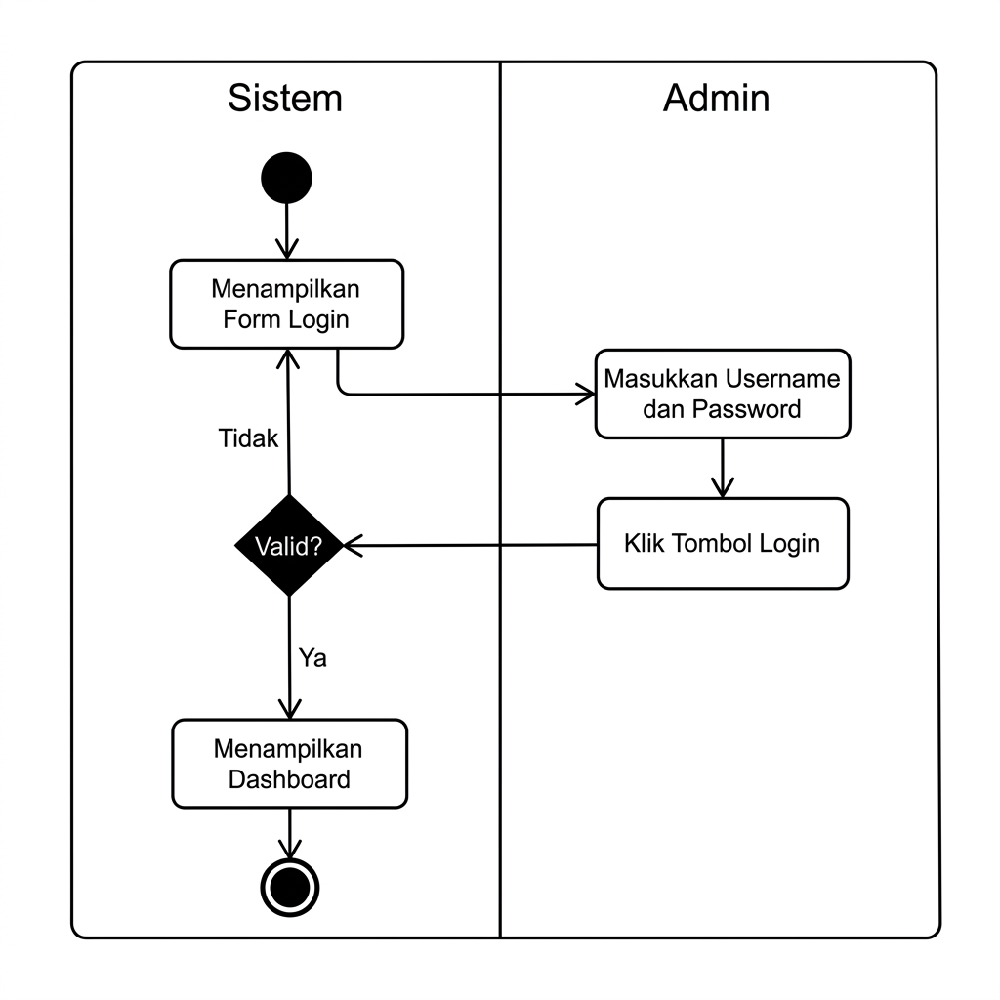

### Alur Diagram (Mermaid)
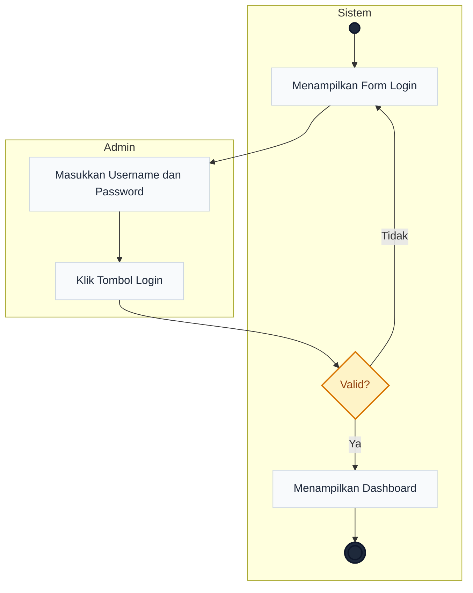
```mermaid
graph TD
    subgraph KolomSistem [Sistem]
        StartNodeNode(( )) --> ShowLoginForm[Menampilkan Form Login]
        ValidateLogin{Valid?}
        ShowDashboard[Menampilkan Dashboard] --> EndNodeNode((( )))
    end

    subgraph KolomAdmin [Admin]
        InputCreds[Masukkan Username dan Password] --> ClickLoginBtn[Klik Tombol Login]
    end

    ShowLoginForm --> InputCreds
    ClickLoginBtn --> ValidateLogin
    ValidateLogin -- Tidak --> ShowLoginForm
    ValidateLogin -- Ya --> ShowDashboard

    %% Styles
    classDef startEnd fill:#1e293b,stroke:#0f172a,stroke-width:2px,color:#fff;
    classDef process fill:#f8fafc,stroke:#cbd5e1,stroke-width:1px,color:#1e293b;
    classDef decision fill:#fef3c7,stroke:#d97706,stroke-width:2px,color:#92400e;
    
    class StartNodeNode,EndNodeNode startEnd;
    class ShowLoginForm,InputCreds,ClickLoginBtn,ShowDashboard process;
    class ValidateLogin decision;
```

### Penjelasan Alur Proses Login Admin:
1. **Sistem** memulai proses dengan menampilkan form login kepada pengguna (`Menampilkan Form Login`).
2. **Admin** memasukkan data otentikasi berupa username dan password (`Masukkan Username dan Password`).
3. **Admin** mengklik tombol login untuk mengirimkan data tersebut ke server (`Klik Tombol Login`).
4. **Sistem** menerima data dan memvalidasinya (`Valid?`):
   * Jika data login **tidak cocok / tidak valid** (pilihan `Tidak`), alur akan kembali menampilkan halaman login (`Menampilkan Form Login`) beserta pesan kesalahan.
   * Jika data login **cocok / valid** (pilihan `Ya`), sistem akan mengarahkan pengguna ke halaman dasbor utama (`Menampilkan Dashboard`).
5. Alur masuk sistem telah selesai dan admin dapat mengelola aplikasi (`Selesai`).

---

## Activity Diagram Akses Dashboard (2 Kolom / Swimlane)

### Ilustrasi Visual
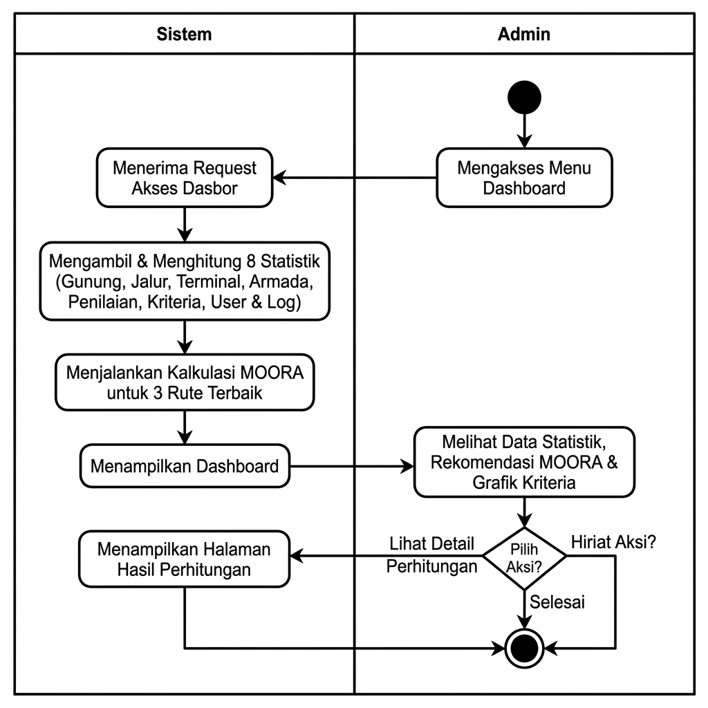

### Alur Diagram (Mermaid)
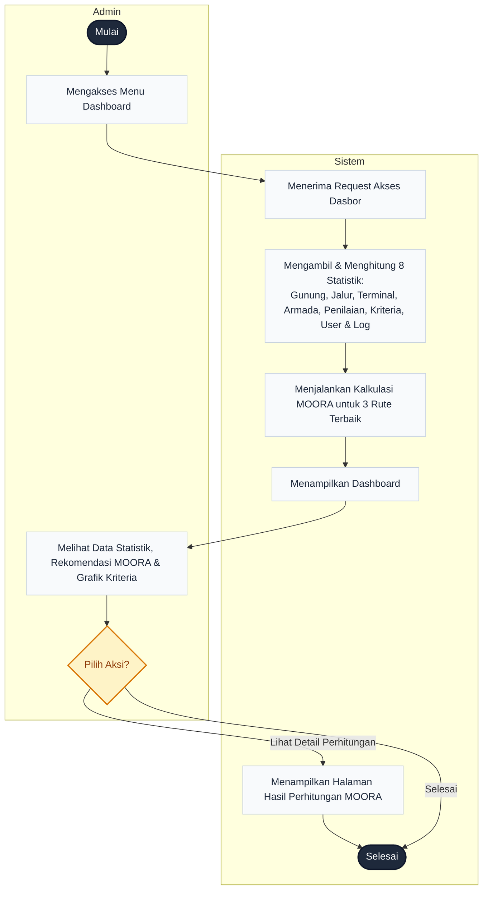
```mermaid
graph TD
    subgraph KolomSistem [Sistem]
        ReceiveReq[Menerima Request Akses Dasbor] --> FetchStats[Mengambil & Menghitung 8 Statistik:<br>Gunung, Jalur, Terminal, Armada, Penilaian, Kriteria, User & Log]
        FetchStats --> RunMoora[Menjalankan Kalkulasi MOORA untuk 3 Rute Terbaik]
        RunMoora --> RenderDashboard[Menampilkan Dashboard]
        
        ShowRankingsDetail[Menampilkan Halaman Hasil Perhitungan MOORA] --> EndNode([Selesai])
    end

    subgraph KolomUser [Admin]
        StartNode([Mulai]) --> AccessMenu[Mengakses Menu Dashboard]
        RenderDashboard --> ViewDashboard[Melihat Data Statistik, Rekomendasi MOORA & Grafik Kriteria]
        ViewDashboard --> ChooseAction{Pilih Aksi?}
        
        ChooseAction -- Lihat Detail Perhitungan --> ShowRankingsDetail
        ChooseAction -- Selesai --> EndNode
    end

    AccessMenu --> ReceiveReq

    %% Styles
    classDef startEnd fill:#1e293b,stroke:#0f172a,stroke-width:2px,color:#fff;
    classDef process fill:#f8fafc,stroke:#cbd5e1,stroke-width:1px,color:#1e293b;
    classDef decision fill:#fef3c7,stroke:#d97706,stroke-width:2px,color:#92400e;
    
    class StartNode,EndNode startEnd;
    class AccessMenu,ReceiveReq,FetchStats,RunMoora,RenderDashboard,ViewDashboard,ShowRankingsDetail process;
    class ChooseAction decision;
```

### Penjelasan Alur Proses Dashboard:
1. **Admin** memulai proses dengan memilih menu dasbor di panel navigasi (`Mengakses Menu Dasbor`).
2. **Sistem** menerima permintaan (`Menerima Request Akses Dasbor`), lalu mengambil dan menghitung 8 statistik utama (Total Gunung, Jalur Pendakian, Terminal Transit, Armada & Tarif, Penilaian Terisi, Kriteria MOORA, Total Pengguna, dan Log Aktivitas) serta grafik perbandingan bobot kriteria (`Mengambil & Menghitung 8 Statistik`).
3. **Sistem** menjalankan kalkulasi perankingan MOORA untuk memproses dan mengambil 3 alternatif rute terbaik (`Menjalankan Kalkulasi MOORA untuk 3 Rute Terbaik`).
4. **Sistem** menyajikan tampilan ke layar (`Menampilkan Dashboard`).
5. **Admin** melihat seluruh ringkasan statistik (8 kartu), rekomendasi 3 rute terbaik, dan grafik kriteria (`Melihat Data Statistik, Rekomendasi MOORA & Grafik Kriteria`).
6. **Admin** dapat melakukan interaksi lanjutan (`Pilih Aksi?`):
    * Klik tombol detail perhitungan $\rightarrow$ mengarahkan ke halaman hasil perangkingan MOORA (`Menampilkan Halaman Hasil Perhitungan`).
    * Selesai menutup halaman dasbor / berpindah menu $\rightarrow$ alur dasbor berakhir (`Selesai`).

---

## Activity Diagram Kelola Data Gunung (2 Kolom / Swimlane)

### Ilustrasi Visual
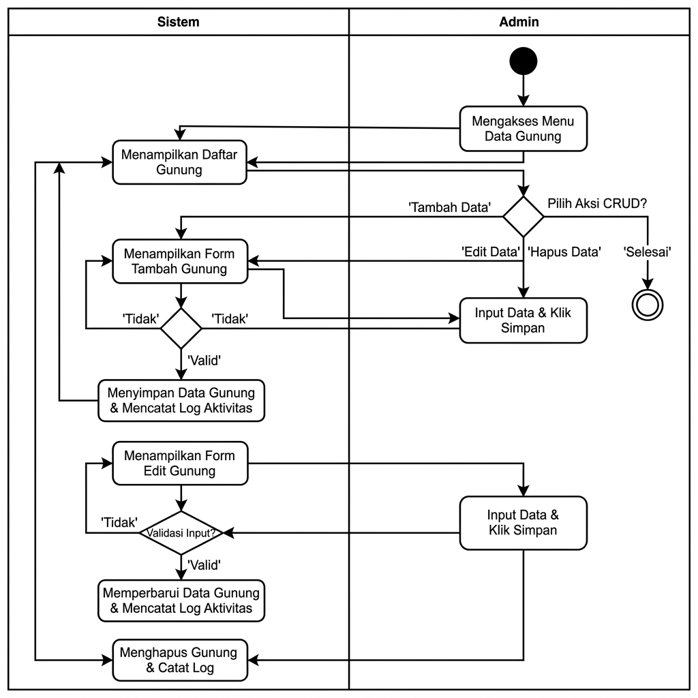

### Alur Diagram (Mermaid)
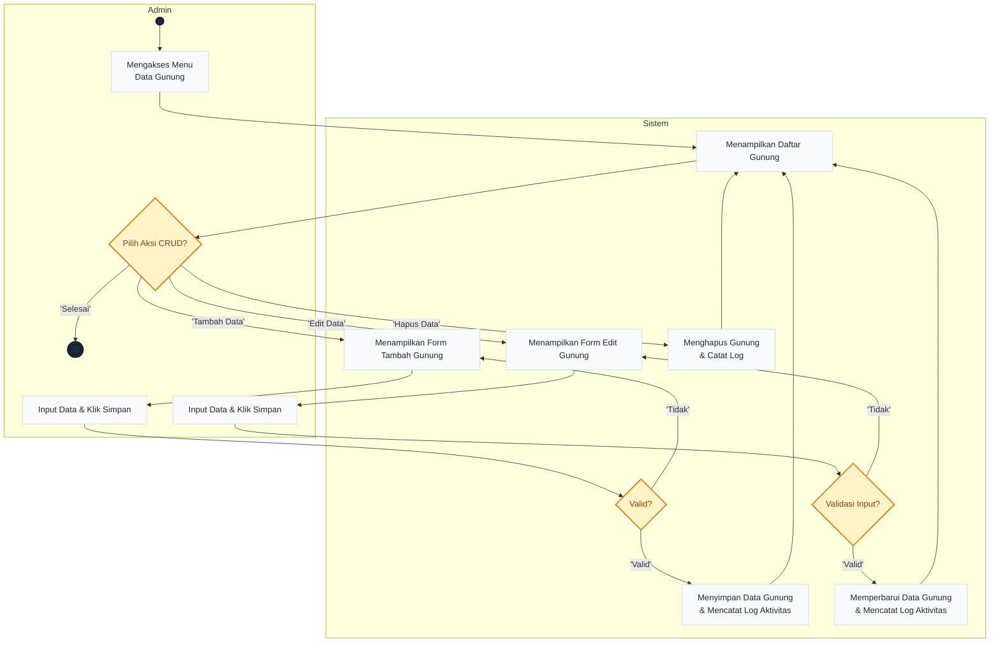
```mermaid
graph TD
    %% Swimlane System
    subgraph KolomSistem [Sistem]
        ShowList[Menampilkan Daftar Gunung]
        ShowAddForm[Menampilkan Form Tambah Gunung]
        ValidateAdd{Valid?}
        SaveAdd[Menyimpan Data Gunung<br>& Mencatat Log Aktivitas]
        
        ShowEditForm[Menampilkan Form Edit Gunung]
        ValidateEdit{Validasi Input?}
        SaveEdit[Memperbarui Data Gunung<br>& Mencatat Log Aktivitas]
        
        DeleteRecord[Menghapus Gunung<br>& Catat Log]
    end

    %% Swimlane Admin
    subgraph KolomAdmin [Admin]
        StartNodeNode(( )) --> AccessMenu[Mengakses Menu<br>Data Gunung]
        ChooseAction{Pilih Aksi CRUD?}
        EndNodeNode((( )))
        
        InputAdd[Input Data & Klik Simpan]
        InputEdit[Input Data & Klik Simpan]
    end

    %% Connections
    AccessMenu --> ShowList
    ShowList --> ChooseAction
    
    ChooseAction -- 'Tambah Data' --> ShowAddForm
    ChooseAction -- 'Edit Data' --> ShowEditForm
    ChooseAction -- 'Hapus Data' --> DeleteRecord
    ChooseAction -- 'Selesai' --> EndNodeNode
    
    ShowAddForm --> InputAdd
    InputAdd --> ValidateAdd
    ValidateAdd -- 'Tidak' --> ShowAddForm
    ValidateAdd -- 'Valid' --> SaveAdd
    SaveAdd --> ShowList
    
    ShowEditForm --> InputEdit
    InputEdit --> ValidateEdit
    ValidateEdit -- 'Tidak' --> ShowEditForm
    ValidateEdit -- 'Valid' --> SaveEdit
    SaveEdit --> ShowList
    
    DeleteRecord --> ShowList

    %% Styles
    classDef startEnd fill:#1e293b,stroke:#0f172a,stroke-width:2px,color:#fff;
    classDef process fill:#f8fafc,stroke:#cbd5e1,stroke-width:1px,color:#1e293b;
    classDef decision fill:#fef3c7,stroke:#d97706,stroke-width:2px,color:#92400e;
    
    class StartNodeNode,EndNodeNode startEnd;
    class AccessMenu,ShowList,ShowAddForm,InputAdd,SaveAdd,ShowEditForm,InputEdit,SaveEdit,DeleteRecord process;
    class ChooseAction,ValidateAdd,ValidateEdit decision;
```

### Penjelasan Alur Proses Kelola Data Gunung:
1. **Admin** memulai alur dengan memilih menu data gunung (`Mengakses Menu Data Gunung`).
2. **Sistem** menyajikan tabel data gunung ke layar (`Menampilkan Daftar Gunung`).
3. **Admin** melihat daftar data dan berinteraksi melalui tombol aksi (`Pilih Aksi CRUD?`):
   * **Tambah Data**:
     1. Sistem menyajikan form input kosong (`Menampilkan Form Tambah Gunung`).
     2. Admin menginput rincian data gunung (nama gunung, deskripsi, dll.) dan mengklik simpan (`Input Data & Klik Simpan`).
     3. Sistem memproses validasi data (`Valid?`): jika tidak valid, kembali menampilkan form tambah dengan pesan error; jika valid, sistem menyimpan data ke database, merekam log aktivitas, dan mengarahkan kembali ke daftar data.
   * **Edit Data**:
     1. Sistem menyajikan form edit yang telah terisi data lama (`Menampilkan Form Edit Gunung`).
     2. Admin mengubah data dan mengklik simpan (`Input Data & Klik Simpan`).
     3. Sistem memproses validasi data (`Validasi Input?`): jika tidak valid, kembali menampilkan form edit dengan pesan error; jika valid, sistem memperbarui database, merekam log aktivitas, dan mengarahkan kembali ke daftar data.
   * **Hapus Data**:
     1. Sistem memproses penghapusan data, mencatat log aktivitas admin, dan menyegarkan tabel data (`Menghapus Gunung & Catat Log`).
   * **Selesai**:
     1. Alur pengelolaan data berakhir (`Selesai`).

---

## Activity Diagram Kelola Data Terminal (2 Kolom / Swimlane)

### Ilustrasi Visual
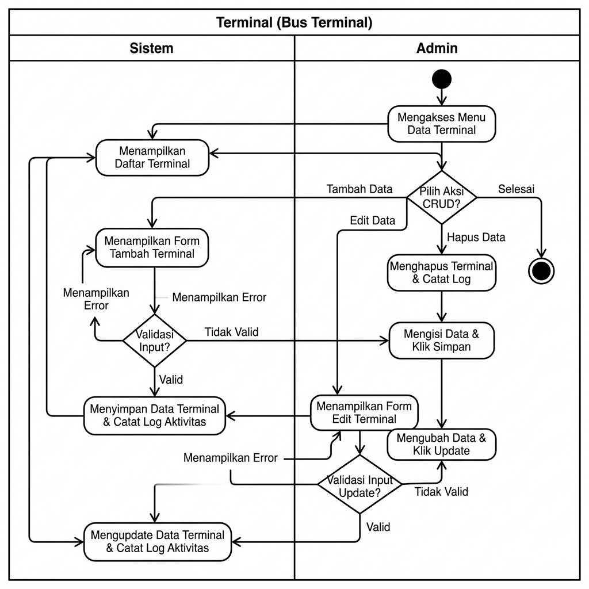

### Alur Diagram (Mermaid)

```mermaid
graph TD
    %% Swimlane System
    subgraph KolomSistem [Sistem]
        ShowList[Menampilkan Daftar Terminal]
        ShowAddForm[Menampilkan Form Tambah Terminal]
        ValidateAdd{Valid?}
        SaveAdd[Menyimpan Data Terminal<br>& Mencatat Log Aktivitas]
        
        ShowEditForm[Menampilkan Form Edit Terminal]
        ValidateEdit{Validasi Input?}
        SaveEdit[Memperbarui Data Terminal<br>& Mencatat Log Aktivitas]
        
        DeleteRecord[Menghapus Terminal<br>& Catat Log]
    end

    %% Swimlane Admin
    subgraph KolomAdmin [Admin]
        StartNodeNode(( )) --> AccessMenu[Mengakses Menu<br>Data Terminal]
        ChooseAction{Pilih Aksi CRUD?}
        EndNodeNode((( )))
        
        InputAdd[Input Data & Klik Simpan]
        InputEdit[Input Data & Klik Simpan]
    end

    %% Connections
    AccessMenu --> ShowList
    ShowList --> ChooseAction
    
    ChooseAction -- 'Tambah Data' --> ShowAddForm
    ChooseAction -- 'Edit Data' --> ShowEditForm
    ChooseAction -- 'Hapus Data' --> DeleteRecord
    ChooseAction -- 'Selesai' --> EndNodeNode
    
    ShowAddForm --> InputAdd
    InputAdd --> ValidateAdd
    ValidateAdd -- 'Tidak' --> ShowAddForm
    ValidateAdd -- 'Valid' --> SaveAdd
    SaveAdd --> ShowList
    
    ShowEditForm --> InputEdit
    InputEdit --> ValidateEdit
    ValidateEdit -- 'Tidak' --> ShowEditForm
    ValidateEdit -- 'Valid' --> SaveEdit
    SaveEdit --> ShowList
    
    DeleteRecord --> ShowList

    %% Styles
    classDef startEnd fill:#1e293b,stroke:#0f172a,stroke-width:2px,color:#fff;
    classDef process fill:#f8fafc,stroke:#cbd5e1,stroke-width:1px,color:#1e293b;
    classDef decision fill:#fef3c7,stroke:#d97706,stroke-width:2px,color:#92400e;
    
    class StartNodeNode,EndNodeNode startEnd;
    class AccessMenu,ShowList,ShowAddForm,InputAdd,SaveAdd,ShowEditForm,InputEdit,SaveEdit,DeleteRecord process;
    class ChooseAction,ValidateAdd,ValidateEdit decision;
```

### Penjelasan Alur Proses Kelola Data Terminal:
1. **Admin** memulai alur dengan memilih menu data terminal (`Mengakses Menu Data Terminal`).
2. **Sistem** menyajikan tabel data terminal ke layar (`Menampilkan Daftar Terminal`).
3. **Admin** melihat daftar data dan berinteraksi melalui tombol aksi (`Pilih Aksi CRUD?`):
   * **Tambah Data**:
     1. Sistem menyajikan form input kosong (`Menampilkan Form Tambah Terminal`).
     2. Admin menginput rincian data terminal (nama terminal, kota/kabupaten) dan mengklik simpan (`Input Data & Klik Simpan`).
     3. Sistem memproses validasi data (`Valid?`): jika tidak valid, kembali menampilkan form tambah dengan pesan error; jika valid, sistem menyimpan data ke database, merekam log aktivitas, dan mengarahkan kembali ke daftar data.
   * **Edit Data**:
     1. Sistem menyajikan form edit yang telah terisi data lama (`Menampilkan Form Edit Terminal`).
     2. Admin mengubah data dan mengklik simpan (`Input Data & Klik Simpan`).
     3. Sistem memproses validasi data (`Validasi Input?`): jika tidak valid, kembali menampilkan form edit dengan pesan error; jika valid, sistem memperbarui database, merekam log aktivitas, dan mengarahkan kembali ke daftar data.
   * **Hapus Data**:
     1. Sistem memproses penghapusan data, mencatat log aktivitas admin, dan menyegarkan tabel data (`Menghapus Terminal & Catat Log`).
   * **Selesai**:
     1. Alur pengelolaan data berakhir (`Selesai`).

---

## Activity Diagram Kelola Data Jalur (2 Kolom / Swimlane)

### Ilustrasi Visual

### Alur Diagram (Mermaid)

```mermaid
graph TD
    %% Swimlane System
    subgraph KolomSistem [Sistem]
        ShowList[Menampilkan Daftar Jalur]
        ShowAddForm[Menampilkan Form Tambah Jalur]
        ValidateAdd{Valid?}
        SaveAdd[Menyimpan Data Jalur<br>& Mencatat Log Aktivitas]
        
        ShowEditForm[Menampilkan Form Edit Jalur]
        ValidateEdit{Validasi Input?}
        SaveEdit[Memperbarui Data Jalur<br>& Mencatat Log Aktivitas]
        
        DeleteRecord[Menghapus Jalur<br>& Catat Log]
    end

    %% Swimlane Admin
    subgraph KolomAdmin [Admin]
        StartNodeNode(( )) --> AccessMenu[Mengakses Menu<br>Data Jalur]
        ChooseAction{Pilih Aksi CRUD?}
        EndNodeNode((( )))
        
        InputAdd[Input Data & Klik Simpan]
        InputEdit[Input Data & Klik Simpan]
    end

    %% Connections
    AccessMenu --> ShowList
    ShowList --> ChooseAction
    
    ChooseAction -- 'Tambah Data' --> ShowAddForm
    ChooseAction -- 'Edit Data' --> ShowEditForm
    ChooseAction -- 'Hapus Data' --> DeleteRecord
    ChooseAction -- 'Selesai' --> EndNodeNode
    
    ShowAddForm --> InputAdd
    InputAdd --> ValidateAdd
    ValidateAdd -- 'Tidak' --> ShowAddForm
    ValidateAdd -- 'Valid' --> SaveAdd
    SaveAdd --> ShowList
    
    ShowEditForm --> InputEdit
    InputEdit --> ValidateEdit
    ValidateEdit -- 'Tidak' --> ShowEditForm
    ValidateEdit -- 'Valid' --> SaveEdit
    SaveEdit --> ShowList
    
    DeleteRecord --> ShowList

    %% Styles
    classDef startEnd fill:#1e293b,stroke:#0f172a,stroke-width:2px,color:#fff;
    classDef process fill:#f8fafc,stroke:#cbd5e1,stroke-width:1px,color:#1e293b;
    classDef decision fill:#fef3c7,stroke:#d97706,stroke-width:2px,color:#92400e;
    
    class StartNodeNode,EndNodeNode startEnd;
    class AccessMenu,ShowList,ShowAddForm,InputAdd,SaveAdd,ShowEditForm,InputEdit,SaveEdit,DeleteRecord process;
    class ChooseAction,ValidateAdd,ValidateEdit decision;
```

### Penjelasan Alur Proses Kelola Data Jalur:
1. **Admin** memulai alur dengan memilih menu data jalur (`Mengakses Menu Data Jalur`).
2. **Sistem** menyajikan tabel data jalur ke layar (`Menampilkan Daftar Jalur`).
3. **Admin** melihat daftar data dan berinteraksi melalui tombol aksi (`Pilih Aksi CRUD?`):
   * **Tambah Data**:
     1. Sistem menyajikan form input kosong (`Menampilkan Form Tambah Jalur`).
     2. Admin memilih gunung terkait, menginput nama jalur, estimasi waktu, simaksi, dan tingkat kesulitan, lalu mengklik simpan (`Input Data & Klik Simpan`).
     3. Sistem memproses validasi data (`Valid?`): jika tidak valid, kembali menampilkan form tambah dengan pesan error; jika valid, sistem menyimpan data ke database, merekam log aktivitas, dan mengarahkan kembali ke daftar data.
   * **Edit Data**:
     1. Sistem menyajikan form edit yang telah terisi data lama (`Menampilkan Form Edit Jalur`).
     2. Admin mengubah rincian data jalur dan mengklik simpan (`Input Data & Klik Simpan`).
     3. Sistem memproses validasi data (`Validasi Input?`): jika tidak valid, kembali menampilkan form edit dengan pesan error; jika valid, sistem memperbarui database, merekam log aktivitas, dan mengarahkan kembali ke daftar data.
   * **Hapus Data**:
     1. Sistem memproses penghapusan data jalur dari database, mencatat log aktivitas admin, dan menyegarkan tabel data (`Menghapus Jalur & Catat Log`).
   * **Selesai**:
     1. Alur pengelolaan data berakhir (`Selesai`).

---

## Activity Diagram Kelola Data Biaya (2 Kolom / Swimlane)

### Ilustrasi Visual

### Alur Diagram (Mermaid)

```mermaid
graph TD
    %% Swimlane System
    subgraph KolomSistem [Sistem]
        ShowList[Menampilkan Daftar Biaya]
        ShowAddForm[Menampilkan Form Tambah Biaya]
        ValidateAdd{Valid?}
        SaveAdd[Menyimpan Data Biaya<br>& Mencatat Log Aktivitas]
        
        ShowEditForm[Menampilkan Form Edit Biaya]
        ValidateEdit{Validasi Input?}
        SaveEdit[Memperbarui Data Biaya<br>& Mencatat Log Aktivitas]
        
        DeleteRecord[Menghapus Biaya<br>& Catat Log]
    end

    %% Swimlane Admin
    subgraph KolomAdmin [Admin]
        StartNodeNode(( )) --> AccessMenu[Mengakses Menu<br>Data Biaya]
        ChooseAction{Pilih Aksi CRUD?}
        EndNodeNode((( )))
        
        InputAdd[Input Data & Klik Simpan]
        InputEdit[Input Data & Klik Simpan]
    end

    %% Connections
    AccessMenu --> ShowList
    ShowList --> ChooseAction
    
    ChooseAction -- 'Tambah Data' --> ShowAddForm
    ChooseAction -- 'Edit Data' --> ShowEditForm
    ChooseAction -- 'Hapus Data' --> DeleteRecord
    ChooseAction -- 'Selesai' --> EndNodeNode
    
    ShowAddForm --> InputAdd
    InputAdd --> ValidateAdd
    ValidateAdd -- 'Tidak' --> ShowAddForm
    ValidateAdd -- 'Valid' --> SaveAdd
    SaveAdd --> ShowList
    
    ShowEditForm --> InputEdit
    InputEdit --> ValidateEdit
    ValidateEdit -- 'Tidak' --> ShowEditForm
    ValidateEdit -- 'Valid' --> SaveEdit
    SaveEdit --> ShowList
    
    DeleteRecord --> ShowList

    %% Styles
    classDef startEnd fill:#1e293b,stroke:#0f172a,stroke-width:2px,color:#fff;
    classDef process fill:#f8fafc,stroke:#cbd5e1,stroke-width:1px,color:#1e293b;
    classDef decision fill:#fef3c7,stroke:#d97706,stroke-width:2px,color:#92400e;
    
    class StartNodeNode,EndNodeNode startEnd;
    class AccessMenu,ShowList,ShowAddForm,InputAdd,SaveAdd,ShowEditForm,InputEdit,SaveEdit,DeleteRecord process;
    class ChooseAction,ValidateAdd,ValidateEdit decision;
```

### Penjelasan Alur Proses Kelola Data Biaya:
1. **Admin** memulai alur dengan memilih menu data biaya (`Mengakses Menu Data Biaya`).
2. **Sistem** menyajikan tabel data biaya ke layar (`Menampilkan Daftar Biaya`).
3. **Admin** melihat daftar data dan berinteraksi melalui tombol aksi (`Pilih Aksi CRUD?`):
   * **Tambah Data**:
     1. Sistem menyajikan form input kosong (`Menampilkan Form Tambah Biaya`).
     2. Admin mengisi data biaya (memilih terminal asal & tujuan, rute jalur, nama armada bus, kelas bus, dan tarif biaya tiket), lalu mengklik simpan (`Input Data & Klik Simpan`).
     3. Sistem memproses validasi data (`Valid?`): jika tidak valid, kembali menampilkan form tambah dengan pesan error; jika valid, sistem menyimpan data biaya baru ke database, merekam log aktivitas, dan mengarahkan kembali ke daftar data.
   * **Edit Data**:
     1. Sistem menyajikan form edit yang telah terisi data lama (`Menampilkan Form Edit Biaya`).
     2. Admin mengubah rincian data biaya dan mengklik simpan (`Input Data & Klik Simpan`).
     3. Sistem memproses validasi data (`Validasi Input?`): jika tidak valid, kembali menampilkan form edit dengan pesan error; jika valid, sistem memperbarui database, merekam log aktivitas, dan mengarahkan kembali ke daftar data.
   * **Hapus Data**:
     1. Sistem memproses penghapusan data biaya dari database, mencatat log aktivitas admin, dan menyegarkan tabel data (`Menghapus Biaya & Catat Log`).
   * **Selesai**:
     1. Alur pengelolaan data berakhir (`Selesai`).

---

## Activity Diagram Kelola Data Kriteria (2 Kolom / Swimlane)

### Ilustrasi Visual

### Alur Diagram (Mermaid)
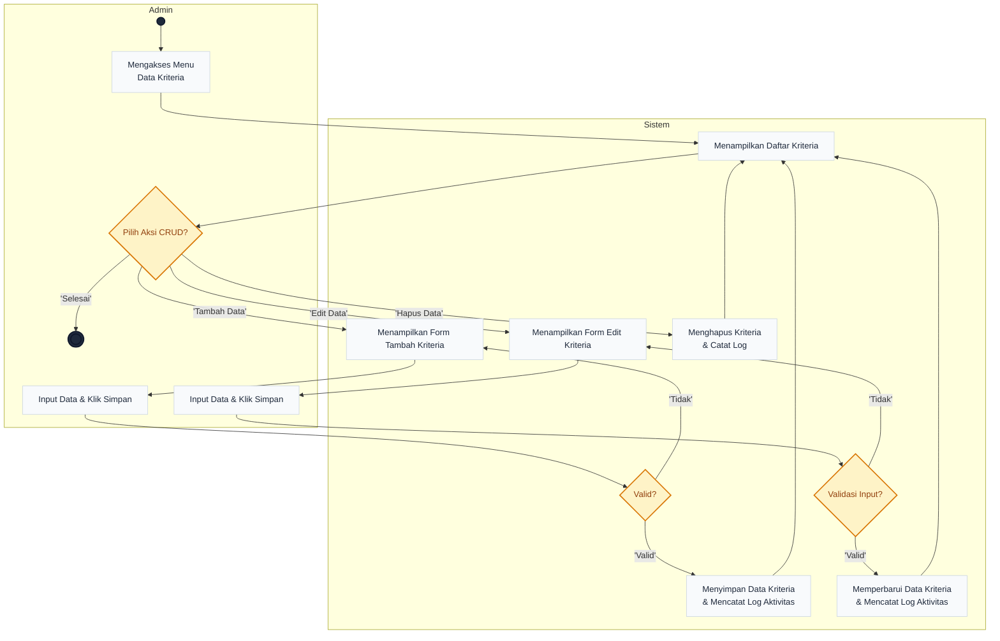
```mermaid
graph TD
    %% Swimlane System
    subgraph KolomSistem [Sistem]
        ShowList[Menampilkan Daftar Kriteria]
        ShowAddForm[Menampilkan Form Tambah Kriteria]
        ValidateAdd{Valid?}
        SaveAdd[Menyimpan Data Kriteria<br>& Mencatat Log Aktivitas]
        
        ShowEditForm[Menampilkan Form Edit Kriteria]
        ValidateEdit{Validasi Input?}
        SaveEdit[Memperbarui Data Kriteria<br>& Mencatat Log Aktivitas]
        
        DeleteRecord[Menghapus Kriteria<br>& Catat Log]
    end

    %% Swimlane Admin
    subgraph KolomAdmin [Admin]
        StartNodeNode(( )) --> AccessMenu[Mengakses Menu<br>Data Kriteria]
        ChooseAction{Pilih Aksi CRUD?}
        EndNodeNode((( )))
        
        InputAdd[Input Data & Klik Simpan]
        InputEdit[Input Data & Klik Simpan]
    end

    %% Connections
    AccessMenu --> ShowList
    ShowList --> ChooseAction
    
    ChooseAction -- 'Tambah Data' --> ShowAddForm
    ChooseAction -- 'Edit Data' --> ShowEditForm
    ChooseAction -- 'Hapus Data' --> DeleteRecord
    ChooseAction -- 'Selesai' --> EndNodeNode
    
    ShowAddForm --> InputAdd
    InputAdd --> ValidateAdd
    ValidateAdd -- 'Tidak' --> ShowAddForm
    ValidateAdd -- 'Valid' --> SaveAdd
    SaveAdd --> ShowList
    
    ShowEditForm --> InputEdit
    InputEdit --> ValidateEdit
    ValidateEdit -- 'Tidak' --> ShowEditForm
    ValidateEdit -- 'Valid' --> SaveEdit
    SaveEdit --> ShowList
    
    DeleteRecord --> ShowList

    %% Styles
    classDef startEnd fill:#1e293b,stroke:#0f172a,stroke-width:2px,color:#fff;
    classDef process fill:#f8fafc,stroke:#cbd5e1,stroke-width:1px,color:#1e293b;
    classDef decision fill:#fef3c7,stroke:#d97706,stroke-width:2px,color:#92400e;
    
    class StartNodeNode,EndNodeNode startEnd;
    class AccessMenu,ShowList,ShowAddForm,InputAdd,SaveAdd,ShowEditForm,InputEdit,SaveEdit,DeleteRecord process;
    class ChooseAction,ValidateAdd,ValidateEdit decision;
```

### Penjelasan Alur Proses Kelola Data Kriteria:
1. **Admin** memulai alur dengan memilih menu data kriteria (`Mengakses Menu Data Kriteria`).
2. **Sistem** menyajikan tabel daftar kriteria (`Menampilkan Daftar Kriteria`).
3. **Admin** melihat daftar data kriteria dan memilih aksi (`Pilih Aksi CRUD?`):
   * **Tambah Data**:
     1. Sistem menyajikan form input kosong (`Menampilkan Form Tambah Kriteria`).
     2. Admin menginput nama kriteria, kode kriteria, tipe (benefit/cost), dan bobot kriteria, lalu mengklik simpan (`Input Data & Klik Simpan`).
     3. Sistem memvalidasi data (`Valid?`): jika tidak valid, kembali menampilkan form tambah; jika valid, sistem menyimpan data kriteria baru ke database, merekam log aktivitas, dan mengarahkan kembali ke daftar data.
   * **Edit Data**:
     1. Sistem menyajikan form edit yang telah terisi data lama (`Menampilkan Form Edit Kriteria`).
     2. Admin mengubah data kriteria dan mengklik simpan (`Input Data & Klik Simpan`).
     3. Sistem memvalidasi data (`Validasi Input?`): jika tidak valid, kembali menampilkan form edit; jika valid, sistem memperbarui database, merekam log aktivitas, dan mengarahkan kembali ke daftar data.
   * **Hapus Data**:
     1. Sistem memproses penghapusan data kriteria, mencatat log aktivitas admin, dan menyegarkan tabel daftar data (`Menghapus Kriteria & Catat Log`).
   * **Selesai**:
     1. Alur pengelolaan data berakhir (`Selesai`).

---

## Activity Diagram Kelola Data Sub-Kriteria (2 Kolom / Swimlane)

### Ilustrasi Visual
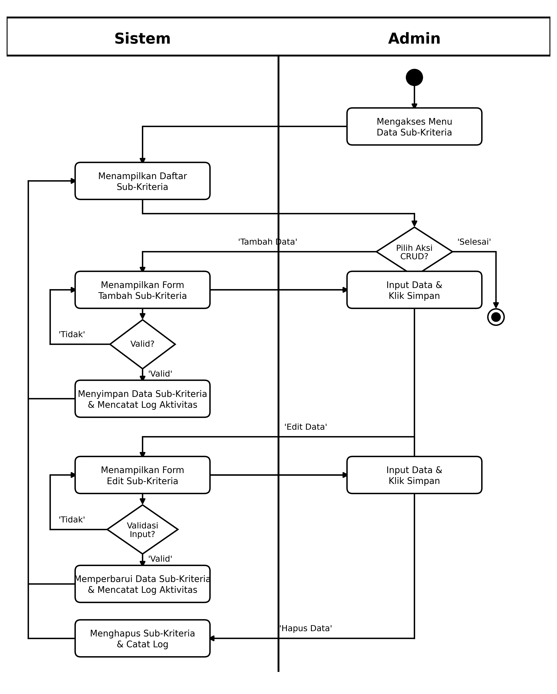

### Alur Diagram (Mermaid)

```mermaid
graph TD
    %% Swimlane System
    subgraph KolomSistem [Sistem]
        ShowList[Menampilkan Daftar Sub-Kriteria]
        ShowAddForm[Menampilkan Form Tambah Sub-Kriteria]
        ValidateAdd{Valid?}
        SaveAdd[Menyimpan Data Sub-Kriteria<br>& Mencatat Log Aktivitas]
        
        ShowEditForm[Menampilkan Form Edit Sub-Kriteria]
        ValidateEdit{Validasi Input?}
        SaveEdit[Memperbarui Data Sub-Kriteria<br>& Mencatat Log Aktivitas]
        
        DeleteRecord[Menghapus Sub-Kriteria<br>& Catat Log]
    end

    %% Swimlane Admin
    subgraph KolomAdmin [Admin]
        StartNodeNode(( )) --> AccessMenu[Mengakses Menu<br>Data Sub-Kriteria]
        ChooseAction{Pilih Aksi CRUD?}
        EndNodeNode((( )))
        
        InputAdd[Input Data & Klik Simpan]
        InputEdit[Input Data & Klik Simpan]
    end

    %% Connections
    AccessMenu --> ShowList
    ShowList --> ChooseAction
    
    ChooseAction -- 'Tambah Data' --> ShowAddForm
    ChooseAction -- 'Edit Data' --> ShowEditForm
    ChooseAction -- 'Hapus Data' --> DeleteRecord
    ChooseAction -- 'Selesai' --> EndNodeNode
    
    ShowAddForm --> InputAdd
    InputAdd --> ValidateAdd
    ValidateAdd -- 'Tidak' --> ShowAddForm
    ValidateAdd -- 'Valid' --> SaveAdd
    SaveAdd --> ShowList
    
    ShowEditForm --> InputEdit
    InputEdit --> ValidateEdit
    ValidateEdit -- 'Tidak' --> ShowEditForm
    ValidateEdit -- 'Valid' --> SaveEdit
    SaveEdit --> ShowList
    
    DeleteRecord --> ShowList

    %% Styles
    classDef startEnd fill:#1e293b,stroke:#0f172a,stroke-width:2px,color:#fff;
    classDef process fill:#f8fafc,stroke:#cbd5e1,stroke-width:1px,color:#1e293b;
    classDef decision fill:#fef3c7,stroke:#d97706,stroke-width:2px,color:#92400e;
    
    class StartNodeNode,EndNodeNode startEnd;
    class AccessMenu,ShowList,ShowAddForm,InputAdd,SaveAdd,ShowEditForm,InputEdit,SaveEdit,DeleteRecord process;
    class ChooseAction,ValidateAdd,ValidateEdit decision;
```

### Penjelasan Alur Proses Kelola Data Sub-Kriteria:
1. **Admin** memulai alur dengan memilih menu data sub-kriteria (`Mengakses Menu Data Sub-Kriteria`).
2. **Sistem** menyajikan halaman daftar sub-kriteria (`Menampilkan Daftar Sub-Kriteria`).
3. **Admin** melihat daftar data sub-kriteria dan memilih aksi (`Pilih Aksi CRUD?`):
   * **Tambah Data**:
     1. Sistem menyajikan form input kosong (`Menampilkan Form Tambah Sub-Kriteria`).
     2. Admin memilih kriteria induk, mengisi nama sub-kriteria, dan bobot nilai sub-kriteria, lalu mengklik simpan (`Input Data & Klik Simpan`).
     3. Sistem memproses validasi data (`Valid?`): jika tidak valid, kembali menampilkan form tambah; jika valid, sistem menyimpan data sub-kriteria baru ke database, merekam log aktivitas, dan mengarahkan kembali ke daftar data.
   * **Edit Data**:
     1. Sistem menyajikan form edit yang telah terisi data lama (`Menampilkan Form Edit Sub-Kriteria`).
     2. Admin mengubah data sub-kriteria dan mengklik simpan (`Input Data & Klik Simpan`).
     3. Sistem memproses validasi data (`Validasi Input?`): jika tidak valid, kembali menampilkan form edit; jika valid, sistem memperbarui database, merekam log aktivitas, dan mengarahkan kembali ke daftar data.
   * **Hapus Data**:
     1. Sistem memproses penghapusan data sub-kriteria, mencatat log aktivitas admin, dan menyegarkan tabel daftar data (`Menghapus Sub-Kriteria & Catat Log`).
   * **Selesai**:
     1. Alur pengelolaan data berakhir (`Selesai`).

---

## Activity Diagram Kelola Data Penilaian (2 Kolom / Swimlane)

### Ilustrasi Visual

### Alur Diagram (Mermaid)
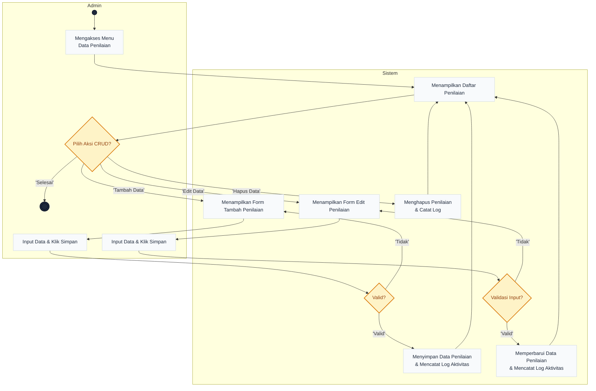
```mermaid
graph TD
    %% Swimlane System
    subgraph KolomSistem [Sistem]
        ShowList[Menampilkan Daftar Penilaian]
        ShowAddForm[Menampilkan Form Tambah Penilaian]
        ValidateAdd{Valid?}
        SaveAdd[Menyimpan Data Penilaian<br>& Mencatat Log Aktivitas]
        
        ShowEditForm[Menampilkan Form Edit Penilaian]
        ValidateEdit{Validasi Input?}
        SaveEdit[Memperbarui Data Penilaian<br>& Mencatat Log Aktivitas]
        
        DeleteRecord[Menghapus Penilaian<br>& Catat Log]
    end

    %% Swimlane Admin
    subgraph KolomAdmin [Admin]
        StartNodeNode(( )) --> AccessMenu[Mengakses Menu<br>Data Penilaian]
        ChooseAction{Pilih Aksi CRUD?}
        EndNodeNode((( )))
        
        InputAdd[Input Data & Klik Simpan]
        InputEdit[Input Data & Klik Simpan]
    end

    %% Connections
    AccessMenu --> ShowList
    ShowList --> ChooseAction
    
    ChooseAction -- 'Tambah Data' --> ShowAddForm
    ChooseAction -- 'Edit Data' --> ShowEditForm
    ChooseAction -- 'Hapus Data' --> DeleteRecord
    ChooseAction -- 'Selesai' --> EndNodeNode
    
    ShowAddForm --> InputAdd
    InputAdd --> ValidateAdd
    ValidateAdd -- 'Tidak' --> ShowAddForm
    ValidateAdd -- 'Valid' --> SaveAdd
    SaveAdd --> ShowList
    
    ShowEditForm --> InputEdit
    InputEdit --> ValidateEdit
    ValidateEdit -- 'Tidak' --> ShowEditForm
    ValidateEdit -- 'Valid' --> SaveEdit
    SaveEdit --> ShowList
    
    DeleteRecord --> ShowList

    %% Styles
    classDef startEnd fill:#1e293b,stroke:#0f172a,stroke-width:2px,color:#fff;
    classDef process fill:#f8fafc,stroke:#cbd5e1,stroke-width:1px,color:#1e293b;
    classDef decision fill:#fef3c7,stroke:#d97706,stroke-width:2px,color:#92400e;
    
    class StartNodeNode,EndNodeNode startEnd;
    class AccessMenu,ShowList,ShowAddForm,InputAdd,SaveAdd,ShowEditForm,InputEdit,SaveEdit,DeleteRecord process;
    class ChooseAction,ValidateAdd,ValidateEdit decision;
```

### Penjelasan Alur Proses Kelola Data Penilaian:
1. **Admin** memulai alur dengan memilih menu data penilaian (`Mengakses Menu Data Penilaian`).
2. **Sistem** menyajikan tabel matriks keputusan dan daftar penilaian alternatif (`Menampilkan Daftar Penilaian`).
3. **Admin** meninjau matriks and memilih aksi (`Pilih Aksi CRUD?`):
   * **Tambah Data**:
     1. Sistem menyajikan form input penilaian baru (`Menampilkan Form Tambah Penilaian`).
     2. Admin memilih rute alternatif pendakian, lalu mengisi skor nilai untuk seluruh kriteria (C1-C6) berdasarkan dropdown sub-kriteria, lalu mengklik simpan (`Input Data & Klik Simpan`).
     3. Sistem memproses validasi data (`Valid?`): jika tidak valid, kembali menampilkan form tambah; jika valid, sistem menyimpan data penilaian ke database, merekam log aktivitas, dan mengarahkan kembali ke daftar data.
   * **Edit Data**:
     1. Sistem menyajikan form edit penilaian rute terpilih (`Menampilkan Form Edit Penilaian`).
     2. Admin mengubah skor nilai kriteria dan mengklik simpan (`Input Data & Klik Simpan`).
     3. Sistem memproses validasi data (`Validasi Input?`): jika tidak valid, kembali menampilkan form edit; jika valid, sistem memperbarui database, merekam log aktivitas, dan mengarahkan kembali ke daftar data.
   * **Hapus Data**:
     1. Sistem memproses penghapusan seluruh penilaian rute alternatif terkait, mencatat log aktivitas admin, dan menyegarkan tabel daftar data (`Menghapus Penilaian & Catat Log`).
   * **Selesai**:
     1. Alur pengelolaan data berakhir (`Selesai`).

---

## Activity Diagram Kelola User (2 Kolom / Swimlane)

### Ilustrasi Visual
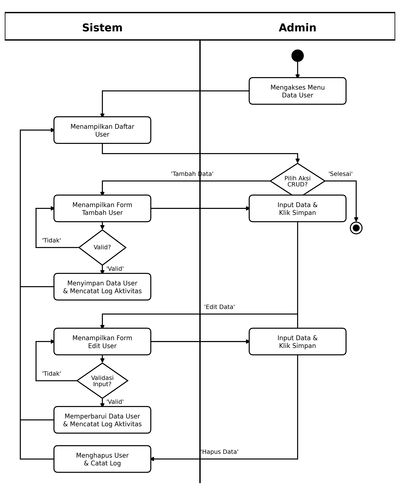

### Alur Diagram (Mermaid)

```mermaid
graph TD
    %% Swimlane System
    subgraph KolomSistem [Sistem]
        ShowList[Menampilkan Daftar User]
        ShowAddForm[Menampilkan Form Tambah User]
        ValidateAdd{Valid?}
        SaveAdd[Menyimpan Data User<br>& Mencatat Log Aktivitas]
        
        ShowEditForm[Menampilkan Form Edit User]
        ValidateEdit{Validasi Input?}
        SaveEdit[Memperbarui Data User<br>& Mencatat Log Aktivitas]
        
        DeleteRecord[Menghapus User<br>& Catat Log]
    end

    %% Swimlane Admin
    subgraph KolomAdmin [Admin]
        StartNodeNode(( )) --> AccessMenu[Mengakses Menu<br>Kelola User]
        ChooseAction{Pilih Aksi CRUD?}
        EndNodeNode((( )))
        
        InputAdd[Input Data & Klik Simpan]
        InputEdit[Input Data & Klik Simpan]
    end

    %% Connections
    AccessMenu --> ShowList
    ShowList --> ChooseAction
    
    ChooseAction -- 'Tambah Data' --> ShowAddForm
    ChooseAction -- 'Edit Data' --> ShowEditForm
    ChooseAction -- 'Hapus Data' --> DeleteRecord
    ChooseAction -- 'Selesai' --> EndNodeNode
    
    ShowAddForm --> InputAdd
    InputAdd --> ValidateAdd
    ValidateAdd -- 'Tidak' --> ShowAddForm
    ValidateAdd -- 'Valid' --> SaveAdd
    SaveAdd --> ShowList
    
    ShowEditForm --> InputEdit
    InputEdit --> ValidateEdit
    ValidateEdit -- 'Tidak' --> ShowEditForm
    ValidateEdit -- 'Valid' --> SaveEdit
    SaveEdit --> ShowList
    
    DeleteRecord --> ShowList

    %% Styles
    classDef startEnd fill:#1e293b,stroke:#0f172a,stroke-width:2px,color:#fff;
    classDef process fill:#f8fafc,stroke:#cbd5e1,stroke-width:1px,color:#1e293b;
    classDef decision fill:#fef3c7,stroke:#d97706,stroke-width:2px,color:#92400e;
    
    class StartNodeNode,EndNodeNode startEnd;
    class AccessMenu,ShowList,ShowAddForm,InputAdd,SaveAdd,ShowEditForm,InputEdit,SaveEdit,DeleteRecord process;
    class ChooseAction,ValidateAdd,ValidateEdit decision;
```

### Penjelasan Alur Proses Kelola User:
1. **Admin (Superadmin)** memulai alur dengan memilih menu kelola user (`Mengakses Menu Kelola User`).
2. **Sistem** menyajikan daftar akun pengguna/admin di layar (`Menampilkan Daftar User`).
3. **Admin** melihat daftar data user dan memilih aksi (`Pilih Aksi CRUD?`):
   * **Tambah Data**:
     1. Sistem menyajikan form input kosong (`Menampilkan Form Tambah User`).
     2. Admin menginput username, nama, peran (role), dan kata sandi baru, lalu mengklik simpan (`Input Data & Klik Simpan`).
     3. Sistem memproses validasi data (`Valid?`): jika tidak valid, kembali menampilkan form tambah dengan pesan error; jika valid, sistem menyimpan user baru ke database, merekam log aktivitas, dan mengarahkan kembali ke daftar data.
   * **Edit Data**:
     1. Sistem menyajikan form edit dengan data terisi (`Menampilkan Form Edit User`).
     2. Admin mengubah data user (misal mengganti nama atau role) dan mengklik simpan (`Input Data & Klik Simpan`).
     3. Sistem memproses validasi data (`Validasi Input?`): jika tidak valid, kembali menampilkan form edit; jika valid, sistem memperbarui database, merekam log aktivitas, dan mengarahkan kembali ke daftar data.
   * **Hapus Data**:
     1. Sistem memproses penghapusan user, mencatat log aktivitas admin, dan menyegarkan tabel daftar data (`Menghapus User & Catat Log`).
   * **Selesai**:
     1. Alur pengelolaan data berakhir (`Selesai`).

---

## Activity Diagram Kelola Log Aktivitas (2 Kolom / Swimlane)

### Ilustrasi Visual
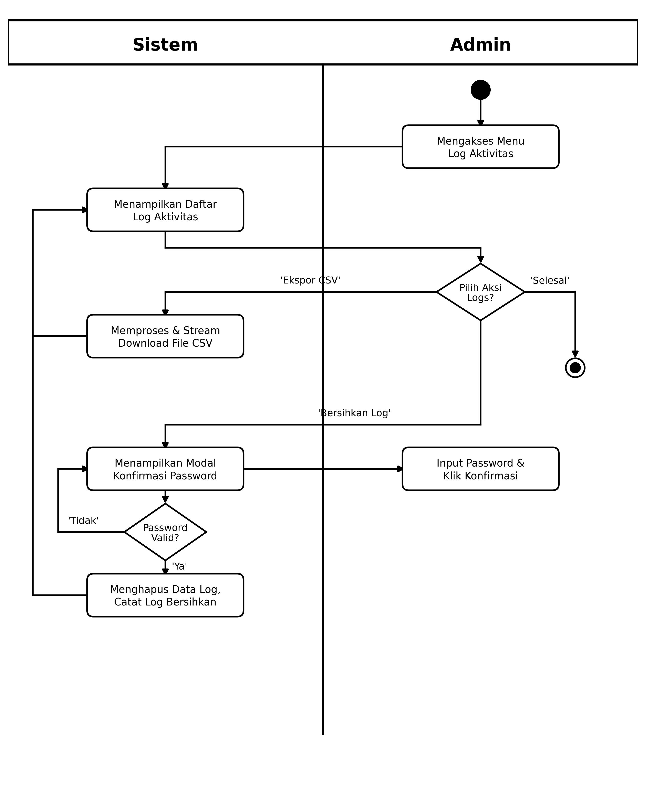

### Alur Diagram (Mermaid)
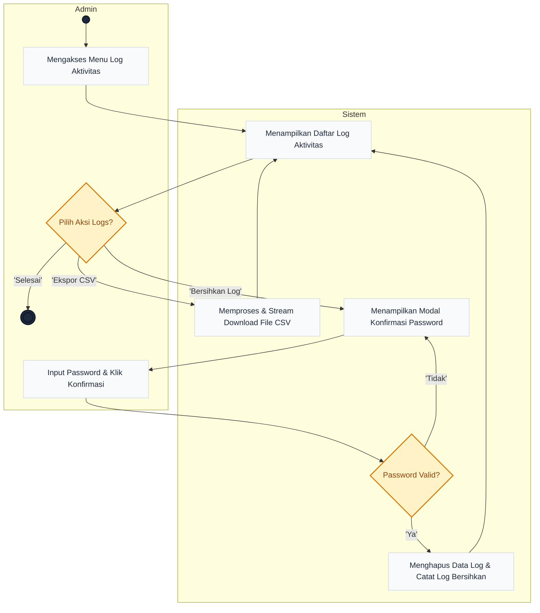
```mermaid
graph TD
    %% Swimlane System
    subgraph KolomSistem [Sistem]
        ShowList[Menampilkan Daftar Log Aktivitas]
        ExportLogs[Memproses & Stream Download File CSV]
        
        ShowConfirmModal[Menampilkan Modal Konfirmasi Password]
        ValidatePassword{Password Valid?}
        PurgeLogs[Menghapus Data Log & Catat Log Bersihkan]
    end

    %% Swimlane Admin
    subgraph KolomAdmin [Admin]
        StartNodeNode(( )) --> AccessMenu[Mengakses Menu Log Aktivitas]
        ChooseAction{Pilih Aksi Logs?}
        EndNodeNode((( )))
        
        InputConfirm[Input Password & Klik Konfirmasi]
    end

    %% Connections
    AccessMenu --> ShowList
    ShowList --> ChooseAction
    
    ChooseAction -- 'Ekspor CSV' --> ExportLogs
    ChooseAction -- 'Bersihkan Log' --> ShowConfirmModal
    ChooseAction -- 'Selesai' --> EndNodeNode
    
    ExportLogs --> ShowList
    
    ShowConfirmModal --> InputConfirm
    InputConfirm --> ValidatePassword
    ValidatePassword -- 'Tidak' --> ShowConfirmModal
    ValidatePassword -- 'Ya' --> PurgeLogs
    PurgeLogs --> ShowList
    
    %% Styles
    classDef startEnd fill:#1e293b,stroke:#0f172a,stroke-width:2px,color:#fff;
    classDef process fill:#f8fafc,stroke:#cbd5e1,stroke-width:1px,color:#1e293b;
    classDef decision fill:#fef3c7,stroke:#d97706,stroke-width:2px,color:#92400e;
    
    class StartNodeNode,EndNodeNode startEnd;
    class AccessMenu,ShowList,ExportLogs,ShowConfirmModal,InputConfirm,PurgeLogs process;
    class ChooseAction,ValidatePassword decision;
```

### Penjelasan Alur Proses Kelola Log Aktivitas:
1. **Admin (Superadmin)** memulai alur dengan memilih menu log aktivitas (`Mengakses Menu Log Aktivitas`).
2. **Sistem** menampilkan tabel log aktivitas yang terpaginasi (`Menampilkan Daftar Log Aktivitas`).
3. **Admin** melihat daftar riwayat log aktivitas dan memilih aksi (`Pilih Aksi Logs?`):
   * **Ekspor CSV**:
     1. Sistem memproses kompilasi data log aktivitas ke format CSV dan men-stream file download langsung ke browser admin (`Memproses & Stream Download File CSV`).
     2. Alur kembali mengarah ke tabel log aktivitas.
   * **Bersihkan Log**:
     1. Sistem menyajikan modal konfirmasi pembersihan log yang aman (`Menampilkan Modal Konfirmasi Password`).
     2. Admin memasukkan password konfirmasi dan mengklik tombol konfirmasi (`Input Password & Klik Konfirmasi`).
     3. Sistem memproses validasi kata sandi (`Password Valid?`): jika salah, kembali menampilkan modal; jika benar, sistem menghapus logs (log > 30 hari atau pembersihan total), merekam aktivitas pembersihan log, dan mengarahkan kembali ke daftar data.
   * **Selesai**:
     1. Alur pemantauan dan pengelolaan log berakhir (`Selesai`).

---

## Activity Diagram Beranda Pendaki (2 Kolom / Swimlane)

### Ilustrasi Visual
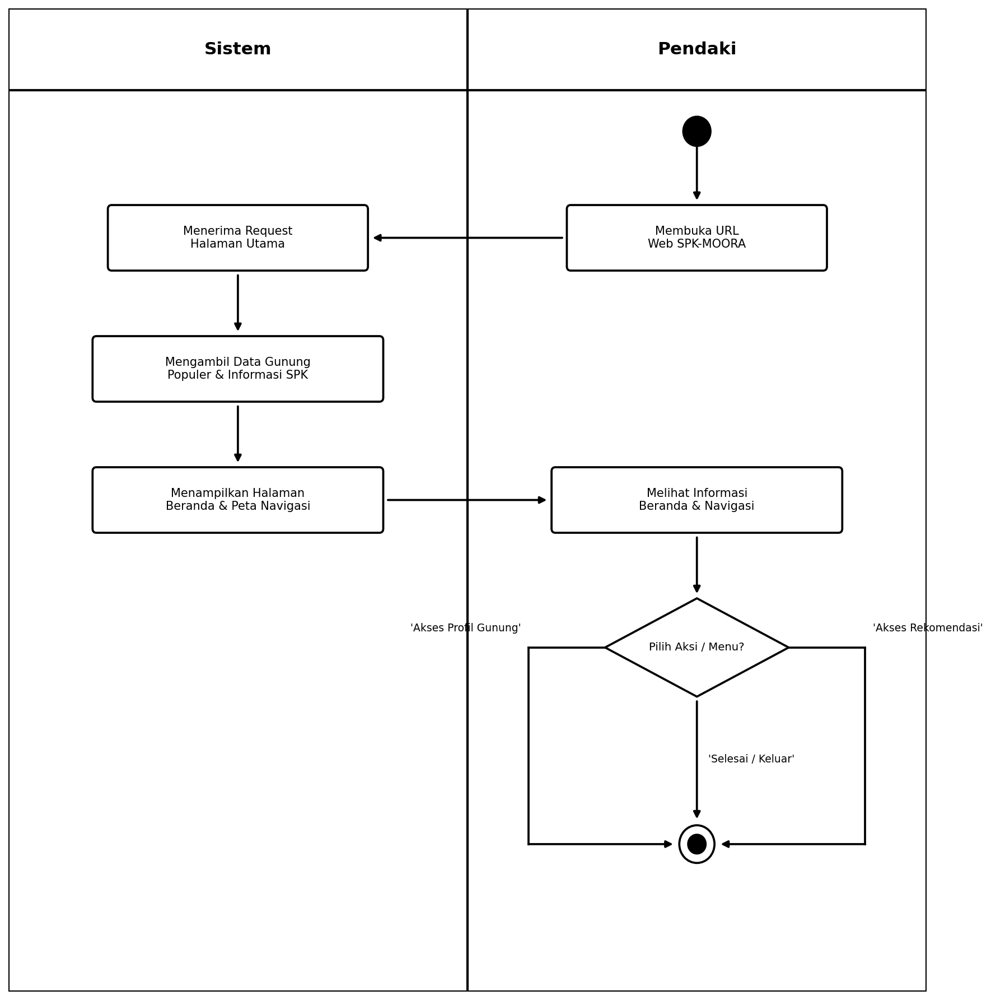

### Alur Diagram (Mermaid)
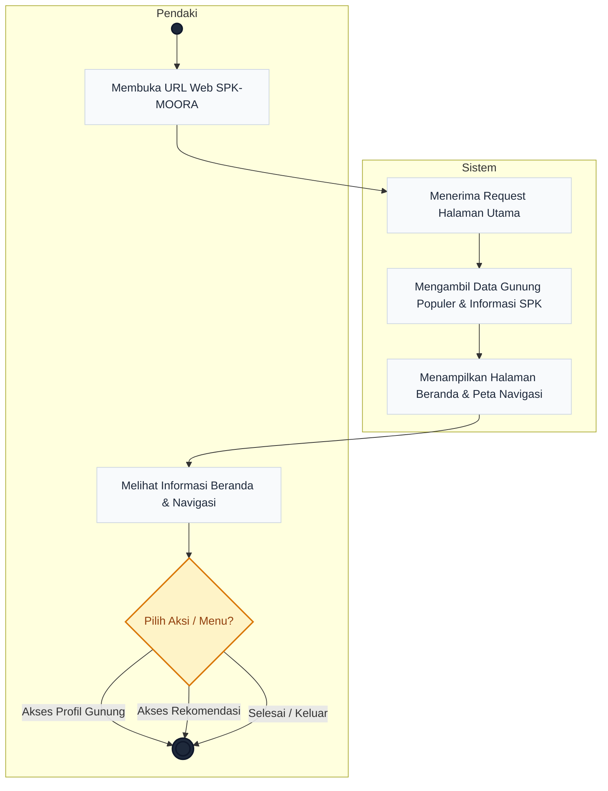
```mermaid
graph TD
    subgraph KolomSistem [Sistem]
        ReceiveReq[Menerima Request Halaman Utama] --> FetchData[Mengambil Data Gunung Populer & Informasi SPK]
        FetchData --> ShowBeranda[Menampilkan Halaman Beranda & Peta Navigasi]
    end

    subgraph KolomPendaki [Pendaki]
        StartNodeNode(( )) --> OpenWeb[Membuka URL Web SPK-MOORA]
        ShowBeranda --> ViewBeranda[Melihat Informasi Beranda & Navigasi]
        
        ViewBeranda --> ChooseAction{Pilih Aksi / Menu?}
        ChooseAction -- "Akses Profil Gunung" --> EndNodeNode((( )))
        ChooseAction -- "Akses Rekomendasi" --> EndNodeNode
        ChooseAction -- "Selesai / Keluar" --> EndNodeNode
    end

    OpenWeb --> ReceiveReq

    %% Styles
    classDef startEnd fill:#1e293b,stroke:#0f172a,stroke-width:2px,color:#fff;
    classDef process fill:#f8fafc,stroke:#cbd5e1,stroke-width:1px,color:#1e293b;
    classDef decision fill:#fef3c7,stroke:#d97706,stroke-width:2px,color:#92400e;
    
    class StartNodeNode,EndNodeNode startEnd;
    class OpenWeb,ReceiveReq,FetchData,ShowBeranda,ViewBeranda process;
    class ChooseAction decision;
```

### Penjelasan Alur Proses Beranda Pendaki:
1. **Pendaki** memulai alur dengan mengakses URL website utama SPK-MOORA (`Membuka URL Web SPK-MOORA`).
2. **Sistem** menerima permintaan halaman utama (`Menerima Request Halaman Utama`).
3. **Sistem** mengambil data dari database berupa daftar gunung populer dan konten panduan SPK (`Mengambil Data Gunung Populer & Informasi SPK`).
4. **Sistem** merender halaman utama pendaki dengan menampilkan peta interaktif serta navigasi utama (`Menampilkan Halaman Beranda & Peta Navigasi`).
5. **Pendaki** dapat melihat informasi umum yang disajikan serta berinteraksi dengan peta navigasi (`Melihat Informasi Beranda & Navigasi`).
6. **Pendaki** kemudian memilih aksi berikutnya (`Pilih Aksi / Menu?`):
   * **Akses Profil Gunung**: Mengarahkan pendaki ke menu profil dan detail informasi gunung (`Selesai`).
   * **Akses Rekomendasi**: Mengarahkan pendaki ke menu perhitungan rekomendasi MOORA (`Selesai`).
   * **Selesai / Keluar**: Pendaki menutup tab/browser atau mengakhiri kunjungan web (`Selesai`).

---

## Activity Diagram Profile Gunung (2 Kolom / Swimlane)

### Ilustrasi Visual
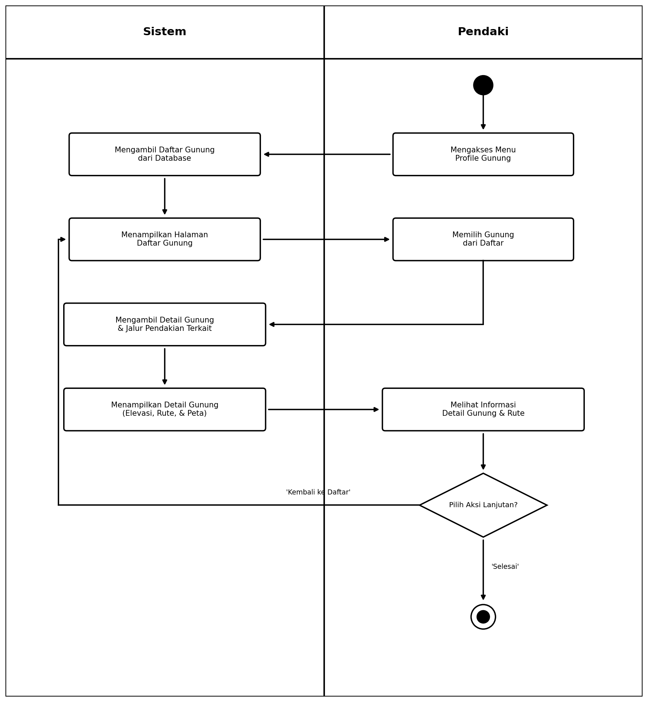

### Alur Diagram (Mermaid)
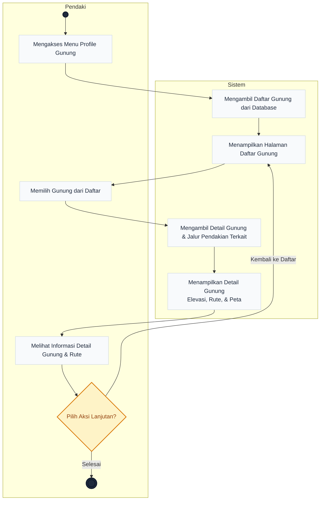
```mermaid
graph TD
    subgraph KolomSistem [Sistem]
        FetchList[Mengambil Daftar Gunung dari Database] --> ShowList[Menampilkan Halaman Daftar Gunung]
        
        FetchDetail[Mengambil Detail Gunung & Jalur Pendakian Terkait] --> ShowDetail[Menampilkan Detail Gunung<br>Elevasi, Rute, & Peta]
    end

    subgraph KolomPendaki [Pendaki]
        StartNodeNode(( )) --> AccessMenu[Mengakses Menu Profile Gunung]
        ShowList --> SelectGunung[Memilih Gunung dari Daftar]
        
        ShowDetail --> ViewDetail[Melihat Informasi Detail Gunung & Rute]
        ViewDetail --> ChooseAction{Pilih Aksi Lanjutan?}
        EndNodeNode((( )))
    end

    AccessMenu --> FetchList
    SelectGunung --> FetchDetail
    
    ChooseAction -- "Selesai" --> EndNodeNode
    ChooseAction -- "Kembali ke Daftar" --> ShowList

    %% Styles
    classDef startEnd fill:#1e293b,stroke:#0f172a,stroke-width:2px,color:#fff;
    classDef process fill:#f8fafc,stroke:#cbd5e1,stroke-width:1px,color:#1e293b;
    classDef decision fill:#fef3c7,stroke:#d97706,stroke-width:2px,color:#92400e;
    
    class StartNodeNode,EndNodeNode startEnd;
    class AccessMenu,FetchList,ShowList,SelectGunung,FetchDetail,ShowDetail,ViewDetail process;
    class ChooseAction decision;
```

### Penjelasan Alur Proses Profile Gunung:
1. **Pendaki** memulai dengan membuka tab/halaman informasi gunung (`Mengakses Menu Profile Gunung`).
2. **Sistem** mengambil data semua gunung pendakian yang terdaftar di database (`Mengambil Daftar Gunung dari Database`).
3. **Sistem** menyajikan tampilan list/katalog daftar gunung kepada pendaki (`Menampilkan Halaman Daftar Gunung`).
4. **Pendaki** meninjau daftar tersebut dan mengklik salah satu gunung untuk melihat detail (`Memilih Gunung dari Daftar`).
5. **Sistem** mengambil data spesifik mengenai gunung tersebut, termasuk data elevasi, deskripsi, lokasi peta, dan jalur pendakian terkait (`Mengambil Detail Gunung & Jalur Pendakian Terkait`).
6. **Sistem** menampilkan halaman detail profil gunung tersebut secara interaktif (`Menampilkan Detail Gunung`).
7. **Pendaki** membaca detail deskripsi, tingkat kesulitan jalur, tarif simaksi, dan estimasi waktu pendakian (`Melihat Informasi Detail Gunung & Rute`).
8. **Pendaki** menentukan tindakan selanjutnya (`Pilih Aksi Lanjutan?`):
   * **Kembali ke Daftar**: Alur akan kembali mengarahkan pendaki ke daftar katalog gunung (`Menampilkan Halaman Daftar Gunung`).
   * **Selesai**: Pendaki keluar atau selesai melihat data (`Selesai`).

---

## Activity Diagram Cari Rekomendasi Pendaki (2 Kolom / Swimlane)

### Ilustrasi Visual
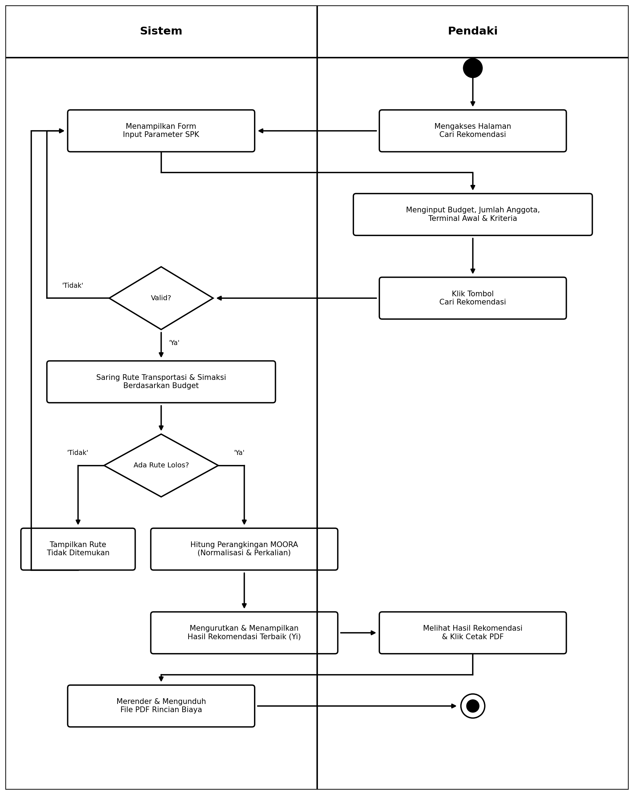

### Alur Diagram (Mermaid)
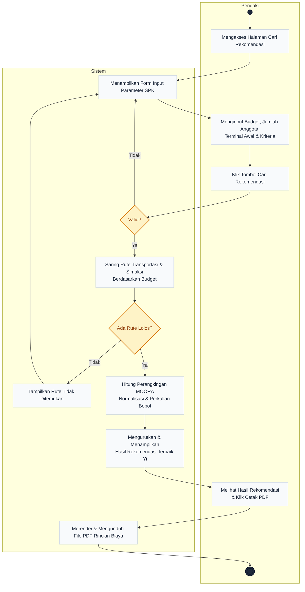
```mermaid
graph TD
    subgraph KolomSistem [Sistem]
        ShowForm[Menampilkan Form Input Parameter SPK]
        ValidateInput{Valid?}
        FilterBudget[Saring Rute Transportasi & Simaksi<br>Berdasarkan Budget]
        CheckRoutes{Ada Rute Lolos?}
        
        ShowEmpty[Tampilkan Rute Tidak Ditemukan]
        CalculateMOORA[Hitung Perangkingan MOORA<br>Normalisasi & Perkalian Bobot]
        SortResults[Mengurutkan & Menampilkan<br>Hasil Rekomendasi Terbaik Yi]
        
        PrintPDF[Merender & Mengunduh File PDF Rincian Biaya]
    end

    subgraph KolomPendaki [Pendaki]
        StartNodeNode(( )) --> AccessMenu[Mengakses Halaman Cari Rekomendasi]
        InputParams[Menginput Budget, Jumlah Anggota,<br>Terminal Awal & Kriteria] --> ClickSearch[Klik Tombol Cari Rekomendasi]
        
        SortResults --> ViewResults[Melihat Hasil Rekomendasi<br>& Klik Cetak PDF]
        PrintPDF --> EndNodeNode((( )))
    end

    AccessMenu --> ShowForm
    ShowForm --> InputParams
    ClickSearch --> ValidateInput
    
    ValidateInput -- "Tidak" --> ShowForm
    ValidateInput -- "Ya" --> FilterBudget
    FilterBudget --> CheckRoutes
    
    CheckRoutes -- "Tidak" --> ShowEmpty
    ShowEmpty --> ShowForm
    
    CheckRoutes -- "Ya" --> CalculateMOORA
    CalculateMOORA --> SortResults
    ViewResults --> PrintPDF

    %% Styles
    classDef startEnd fill:#1e293b,stroke:#0f172a,stroke-width:2px,color:#fff;
    classDef process fill:#f8fafc,stroke:#cbd5e1,stroke-width:1px,color:#1e293b;
    classDef decision fill:#fef3c7,stroke:#d97706,stroke-width:2px,color:#92400e;
    
    class StartNodeNode,EndNodeNode startEnd;
    class AccessMenu,ShowForm,InputParams,ClickSearch,FilterBudget,ShowEmpty,CalculateMOORA,SortResults,ViewResults,PrintPDF process;
    class ValidateInput,CheckRoutes decision;
```

### Penjelasan Alur Proses Cari Rekomendasi Pendaki:
1. **Pendaki** membuka menu pencarian rekomendasi rute pendakian gunung (`Mengakses Halaman Cari Rekomendasi`).
2. **Sistem** menampilkan halaman antarmuka form pencarian rekomendasi dengan inputan parameter (`Menampilkan Form Input Parameter SPK`).
3. **Pendaki** mengisi data parameter pencarian yang meliputi budget maksimal, total anggota rombongan pendakian, terminal keberangkatan awal, serta preferensi bobot kriteria kustom (`Menginput Budget, Jumlah Anggota, Terminal Awal & Kriteria`).
4. **Pendaki** mengirimkan form pencarian tersebut ke sistem (`Klik Tombol Cari Rekomendasi`).
5. **Sistem** melakukan validasi form input (`Valid?`):
   * Jika **tidak valid** (pilihan `Tidak`), sistem akan menampilkan kembali form input beserta pesan kesalahan validasi.
   * Jika **valid** (pilihan `Ya`), sistem melanjutkan ke tahap berikutnya.
6. **Sistem** menyaring seluruh kombinasi rute transportasi bus dan biaya simaksi, mengecualikan rute yang total biaya estimasinya melebihi budget pendaki (`Saring Rute Transportasi & Simaksi Berdasarkan Budget`).
7. **Sistem** memeriksa hasil penyaringan (`Ada Rute Lolos?`):
   * Jika **tidak ada** rute yang lolos (pilihan `Tidak`), sistem menampilkan notifikasi rute tidak ditemukan (`Tampilkan Rute Tidak Ditemukan`) dan mengembalikan pendaki ke form input parameter.
   * Jika **ada** rute yang lolos (pilihan `Ya`), sistem memproses data alternatif rute tersebut menggunakan metode perhitungan MOORA (`Hitung Perangkingan MOORA`).
8. **Sistem** menghitung normalisasi matriks keputusan awal dan mengalikan dengan bobot kriteria untuk mendapatkan nilai akhir $Y_i$.
9. **Sistem** mengurutkan alternatif berdasarkan nilai preferensi tertinggi lalu menampilkannya di halaman hasil (`Mengurutkan & Menampilkan Hasil Rekomendasi Terbaik Yi`).
10. **Pendaki** meninjau perangkingan hasil MOORA, memilih rute ideal, dan menekan tombol cetak (`Melihat Hasil Rekomendasi & Klik Cetak PDF`).
11. **Sistem** merender berkas cetak PDF yang memuat rincian estimasi biaya secara terstruktur dan mengunduhnya secara otomatis (`Merender & Mengunduh File PDF Rincian Biaya`).
12. Alur pencarian rekomendasi selesai (`Selesai`).
