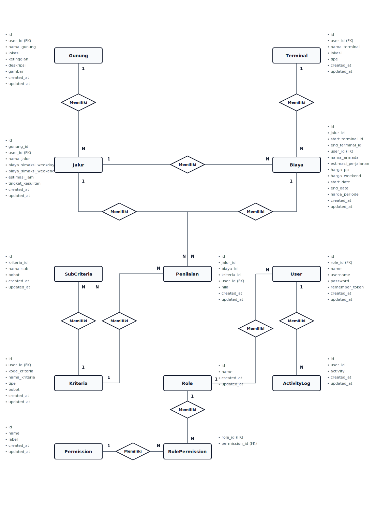

# Entity Relationship Diagram (ERD) - SPK-MOORA

Dokumen ini berisi visualisasi dan deskripsi relasi antar-tabel (Entity Relationship Diagram) untuk database project **SPK-MOORA** (Sistem Pendukung Keputusan pemilihan jalur pendakian gunung menggunakan metode MOORA).

## Diagram ERD (Chen Notation Style)

Berikut adalah visualisasi ERD database menggunakan format **Chen Notation** (Entitas direpresentasikan dengan persegi panjang, Relasi dengan belah ketupat/diamond, dan Atribut tertulis di sekelilingnya) sesuai gaya diagram akademis formal:

---

## Deskripsi Tabel & Relasi

### 1. Tabel Utama Pendakian

*   **`gunungs`**: Menyimpan data gunung yang tersedia (nama, lokasi, ketinggian, deskripsi, gambar).
*   **`jalurs`**: Menyimpan jalur pendakian spesifik untuk setiap gunung.
    *   *Relasi*: Banyak jalur (`jalurs`) terhubung ke satu gunung (`gunungs`) melalui foreign key `gunung_id`.
*   **`terminals`**: Menyimpan titik transit (terminal/titik mulai & akhir perjalanan) untuk transportasi.
    *   *Relasi*: Memiliki tipe (`tipe`) berupa 'Starting Point' atau 'Ending Point'.

### 2. Tabel Keuangan & Transportasi

*   **`biayas`**: Menyimpan data biaya transportasi (armada, harga pp, weekend price, dan harga periode khusus).
    *   *Relasi*: 
        *   Terhubung ke `jalurs` via `jalur_id` (opsional/nullable).
        *   Terhubung ke `terminals` sebagai titik awal (`start_terminal_id`) dan titik akhir (`end_terminal_id`).

> [!NOTE]
> **Catatan Struktur Database**: Kolom `jalur_id` pada tabel `biayas` di database local Anda terhubung sebagai foreign key ke `jalurs(id)`, tetapi kolom ini tidak dideklarasikan di file migration `2026_01_19_074942_create_biayas_table.php` (ditambahkan langsung ke database atau ada inkonsistensi migration). Model Eloquent `Biaya.php` dan `BiayaController` sudah menggunakannya secara aktif.

### 3. Tabel SPK (Metode MOORA)

*   **`kriterias`**: Menyimpan kriteria penilaian untuk MOORA (misalnya C1, C2). Memiliki `tipe` ('Benefit' atau 'Cost') dan `bobot` kriteria.
*   **`sub_kriterias`**: Menyimpan sub-kriteria/skala nilai parameter dari setiap kriteria (misal: "Sangat Murah" dengan bobot 5).
    *   *Relasi*: Banyak sub-kriteria terhubung ke satu kriteria (`kriterias`) via `kriteria_id`.
*   **`penilaians`**: Tabel transaksi penilaian alternatif (Jalur + Armada) berdasarkan kriteria yang ditentukan.
    *   *Relasi*: 
        *   Mencatat `nilai` konkret (rating/skala) untuk kombinasi `jalur_id`, `biaya_id`, dan `kriteria_id`.
        *   Terhubung secara many-to-one ke `jalurs`, `biayas` (armada bus), dan `kriterias`.
