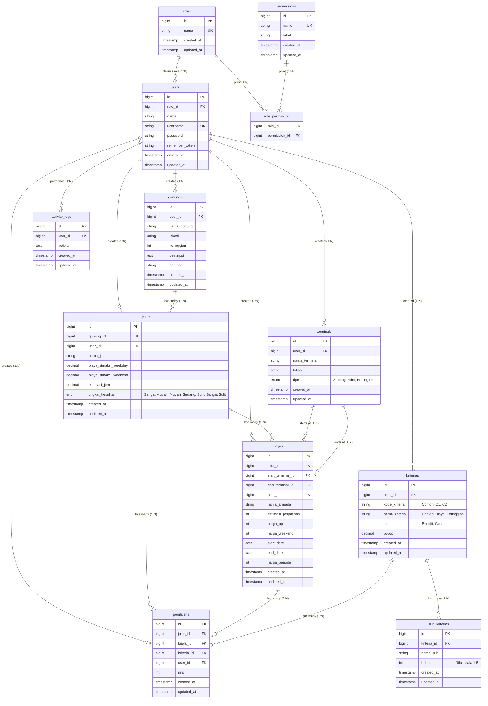

# Entity Relationship Diagram (ERD) - SPK-MOORA

Dokumen ini berisi visualisasi dan deskripsi relasi antar-tabel (Entity Relationship Diagram) untuk database project **SPK-MOORA** (Sistem Pendukung Keputusan pemilihan jalur pendakian gunung menggunakan metode MOORA) setelah penambahan hak akses dinamis (Roles & Permissions) dan tracking penciptaan data (`user_id`).

## Diagram ERD (Mermaid)

Berikut adalah visualisasi ERD database. Diagram ini menunjukkan relasi antar entitas utama seperti Hak Akses (Roles/Permissions), Pengguna (Users), Gunung, Jalur, Terminal, Biaya, Kriteria, Sub-Kriteria, Penilaian, dan Log Aktivitas.

---

## Deskripsi Tabel & Relasi

### 1. Tabel Autentikasi & Hak Akses (RBAC)

*   **`users`**: Menyimpan akun pengguna (Superadmin, Admin) yang memiliki kredensial login (`username`, `password`).
    *   *Relasi*: Terhubung ke tabel `roles` melalui `role_id` (Many-to-One).
*   **`roles`**: Menyimpan peran pengguna (contoh: `Superadmin`, `Admin`).
*   **`permissions`**: Menyimpan daftar hak akses spesifik (contoh: `manage_users`, `view_logs`, `manage_gunung`, `manage_kriteria`, `view_hasil`).
*   **`role_permission`**: Tabel pivot penghubung Many-to-Many antara `roles` dan `permissions`.

### 2. Tabel Utama Pendakian & Transportasi (Master Data)

Seluruh data master kini terhubung ke `users` melalui kolom `user_id` untuk mencatat siapa admin yang menginput/memodifikasi data tersebut.

*   **`gunungs`**: Menyimpan data gunung yang tersedia (nama, lokasi, ketinggian, deskripsi, gambar).
    *   *Relasi*: Terhubung ke `users` via `user_id`. Banyak jalur (`jalurs`) terhubung ke satu gunung melalui `gunung_id`.
*   **`jalurs`**: Menyimpan rute/jalur pendakian spesifik untuk setiap gunung.
    *   *Relasi*: Terhubung ke `users` via `user_id`. Terhubung ke `gunungs` via `gunung_id` (Many-to-One).
*   **`terminals`**: Menyimpan titik transit awal dan akhir perjalanan armada bus.
    *   *Relasi*: Terhubung ke `users` via `user_id`. Memiliki tipe (`tipe`) berupa 'Starting Point' atau 'Ending Point'.
*   **`biayas`**: Menyimpan data biaya transportasi (armada, harga tiket PP, weekend price, dan harga periode khusus).
    *   *Relasi*: 
        *   Terhubung ke `users` via `user_id`.
        *   Terhubung ke `jalurs` via `jalur_id` (opsional).
        *   Terhubung ke `terminals` sebagai titik awal (`start_terminal_id`) dan titik akhir (`end_terminal_id`).

### 3. Tabel SPK (Metode MOORA)

*   **`kriterias`**: Menyimpan kriteria penilaian untuk MOORA (misalnya C1 s/d C6). Memiliki `tipe` ('Benefit' atau 'Cost') dan `bobot` kriteria.
    *   *Relasi*: Terhubung ke `users` via `user_id`.
*   **`sub_kriterias`**: Menyimpan sub-kriteria/skala nilai parameter dari setiap kriteria (misal: "Sangat Murah" dengan bobot 5).
    *   *Relasi*: Banyak sub-kriteria terhubung ke satu kriteria (`kriterias`) via `kriteria_id`.
*   **`penilaians`**: Tabel transaksi penilaian alternatif (Jalur + Armada) berdasarkan kriteria yang ditentukan.
    *   *Relasi*: 
        *   Terhubung ke `users` via `user_id`.
        *   Mencatat `nilai` konkret (skor 1-5) untuk kombinasi `jalur_id`, `biaya_id`, dan `kriteria_id`.

### 4. Tabel Audit Trail

*   **`activity_logs`**: Menyimpan catatan riwayat aktivitas admin (log audit) seperti penambahan, pengubahan, atau penghapusan data secara otomatis.
    *   *Relasi*: Terhubung ke `users` melalui `user_id` (Many-to-One).
