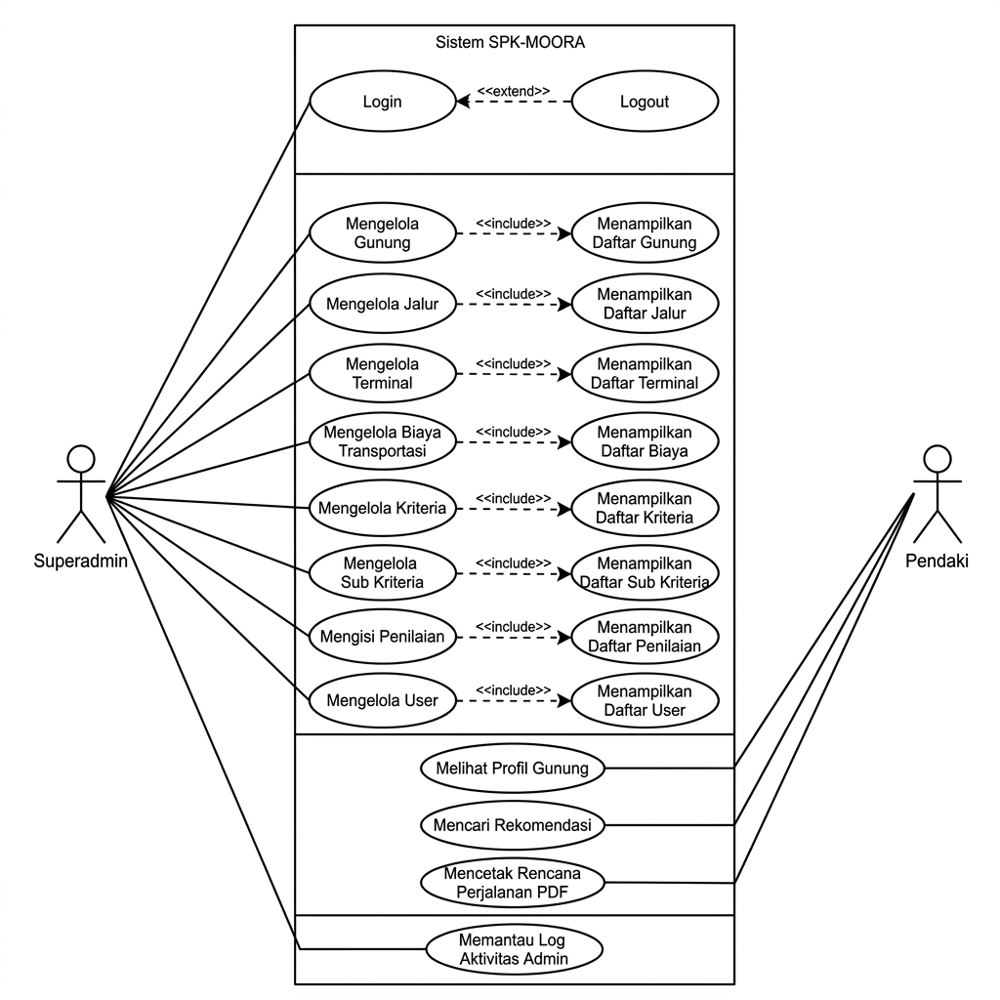
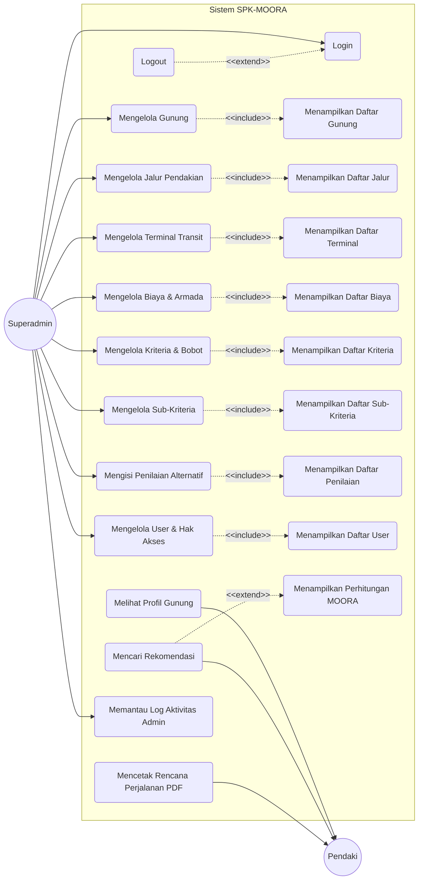

# Use Case Diagram - SPK-MOORA

Dokumen ini mendefinisikan **Use Case Diagram** untuk sistem **SPK-MOORA** (Sistem Pendukung Keputusan Pemilihan Jalur Pendakian Gunung menggunakan Metode MOORA) yang disesuaikan dengan contoh struktur formal skripsi Anda (menggunakan relasi `<<include>>` antara fungsi **Mengelola** dan **Menampilkan**, serta relasi `<<extend>>` pada **Login/Logout** dan **Pencarian**).

---

## 1. Gambar Diagram Use Case (Visual)

Berikut adalah gambar diagram Use Case untuk sistem SPK-MOORA yang dihasilkan sesuai dengan model desain sistem:

---

## 2. Diagram Use Case (Sintaksis Mermaid)

Berikut adalah representasi diagram use case menggunakan sintaksis Mermaid. Diagram ini membagi aktor utama menjadi **Superadmin** di sisi kiri, serta **Pendaki (User/Guest)** di sisi kanan.

---

## 2. Deskripsi Hubungan Relasi Use Case

Berdasarkan diagram di atas, berikut adalah penjelasan relasi asosiasi, `<<include>>`, dan `<<extend>>` yang terjadi di dalam sistem:

### **A. Hubungan `<<include>>` (Ketergantungan Wajib)**
Hubungan ini menunjukkan bahwa proses **Mengelola** suatu data master wajib menyertakan proses **Menampilkan** data tersebut pada layar antarmuka pengguna:
1.  **Mengelola Gunung `<<include>>` Menampilkan Daftar Gunung**: Proses penambahan/pengubahan data gunung memerlukan sistem untuk menampilkan visualisasi data gunung yang ada terlebih dahulu.
2.  **Mengelola Jalur `<<include>>` Menampilkan Daftar Jalur**: Menambah/mengubah jalur pendakian mewajibkan sistem menampilkan daftarnya pada dashboard.
3.  **Mengelola Terminal `<<include>>` Menampilkan Daftar Terminal**: Memperbarui koordinat/lokasi transit memerlukan penampilan data terminal.
4.  **Mengelola Biaya & Armada `<<include>>` Menampilkan Daftar Biaya**: Proses pengelolaan tarif transportasi wajib menampilkan list tarif bus yang aktif.
5.  **Mengelola Kriteria & Bobot `<<include>>` Menampilkan Daftar Kriteria**: Penyetelan bobot MOORA didahului dengan penampilan nilai bobot kriteria saat ini.
6.  **Mengelola Sub-Kriteria `<<include>>` Menampilkan Daftar Sub-Kriteria**: Manajemen skala pembobotan menyertakan penampilan rentang nilai parameter.
7.  **Mengisi Penilaian `<<include>>` Menampilkan Daftar Penilaian**: Pengisian skor alternatif (skala 1-5) menyertakan tampilan matriks keputusan.
8.  **Mengelola User & Hak Akses `<<include>>` Menampilkan Daftar User**: Manajemen pendaftaran admin oleh Superadmin memerlukan tampilan daftar user yang aktif.

### **B. Hubungan `<<extend>>` (Ketergantungan Opsional/Kondisional)**
Hubungan ini menggambarkan perluasan alur kerja yang hanya terjadi pada kondisi tertentu:
1.  **Logout `<<extend>>` Login**: Aksi *Logout* merupakan perluasan opsional setelah aktor berhasil melakukan *Login* ke dalam sistem. Aktor tidak dapat logout jika belum berada dalam status login.
2.  **Mencari Rekomendasi `<<extend>>` Menampilkan Perhitungan MOORA**: Ketika pendaki melakukan pencarian rekomendasi rute dengan menginput nominal budget dan stasiun asal, sistem secara opsional memperluas proses untuk menampilkan rincian hasil komputasi normalisasi matriks MOORA di layar hasil pencarian.
